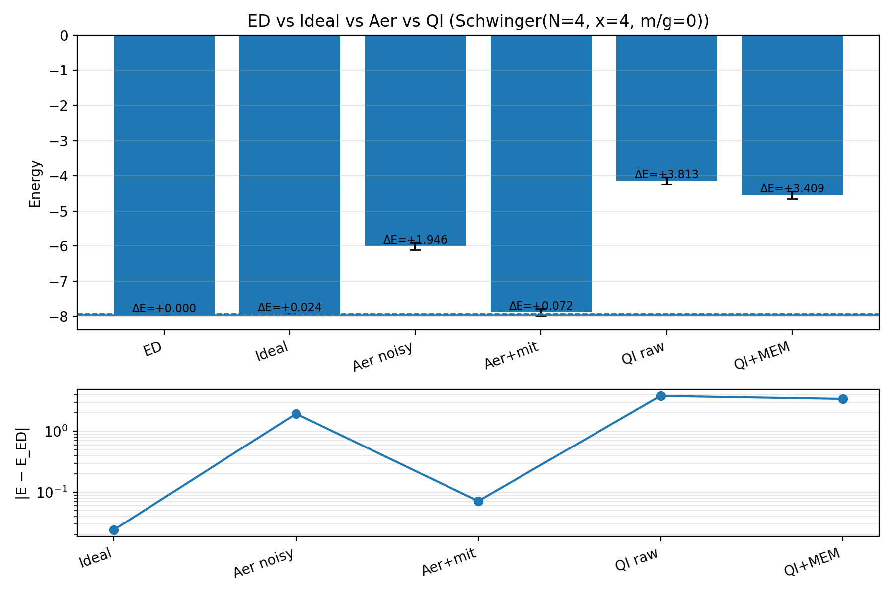

# Static Benchmarks — Results & Validation

## Gauge-Simulation Workstream (Schwinger / lattice dynamics): Symmetry-Preserving VQE and Trotter De-risking

**Symmetry-preserving VQE and Trotter de-risking for the gauge-eliminated Schwinger model**

This document presents the numerical results for Static Benchmarks Gauge-Simulation Workstream  : (1) sector-projected VQE benchmarking at $N=4$ with depth and ansatz sweeps, (2) extension to $N=8$ using semi-local generator grouping with analytic adjoint gradients, and (3) first-order Trotter evolution validated against exact time evolution at both $N=4$ and $N=8$. All simulations use the gauge-eliminated spin-chain Hamiltonian validated in Validation Baseline (Check 1).

**Code:** `02_Static Benchmarks/vqe_optimizer(N=4).py` (N=4 sweeps), `02_Static Benchmarks/vqe_optimizer(N=8)_trotter_derisk.py` (N=8 semi-local grouping + de-risking for both N=4 and N=8)

---

## 1. Symmetry Exploitation: $U(1)$ Charge-Sector Projection

### Motivation

The Validation Baseline Hamiltonian checks confirmed that the gauge-eliminated Schwinger Hamiltonian commutes with total $Z$-magnetization $\sum_k Z_k$, equivalently with the total charge $Q = -\frac{1}{2}\sum_n Z_n$ (Theory Summary §2.3). This means $H$ block-diagonalizes into magnetization sectors labelled by $M = \sum_n Z_n$. The staggered vacuum $|\Omega\rangle = |0101\cdots\rangle$ lives in the $M=0$ sector (equal numbers of $|0\rangle$ and $|1\rangle$ sites), and the ground state is guaranteed to lie within this sector.

This observation, combined with the equivariant-ansatz framework of Meyer et al. (2023) previously applied to the Heisenberg and Kitaev chain models, motivates two improvements over a naive full-space VQE:

1. **Sector projection.** Restrict the Hamiltonian and all ansatz operations to the $M=0$ subspace by constructing the projector $P$ whose columns are the computational-basis states with exactly $N/2$ occupied sites. The projected Hamiltonian $H_s = P^\dagger H P$ has reduced dimension $d_{\text{sector}} = \binom{N}{N/2}$. This guarantees the variational search stays in the correct charge sector and reduces linear algebra cost (matrix exponentials act on smaller matrices).

2. **Equivariant HVA ansatz.** The ansatz is built from generators that individually preserve $M$: the XY hopping $\propto (X_nX_{n+1} + Y_nY_{n+1})$ swaps $|01\rangle \leftrightarrow |10\rangle$ without changing $\sum Z$, while the mass and electric terms are diagonal in $Z$ and trivially commute with it. No symmetry-breaking gates (such as global $R_Y$ rotations) are needed or included.

**Important nuance.** Because the HVA ansatz generators already preserve magnetization and the initial state $|\Omega\rangle$ is already in the $M=0$ sector, a full-space VQE with these gates would also remain in-sector throughout. At $N=4$, the full-space and projected global ansatz produce essentially the same energy at matched depth and restarts. The improvements in VQE accuracy reported below are therefore primarily driven by (a) ansatz expressivity (local per-bond angles vs. shared global angles), (b) the switch from COBYLA to L-BFGS-B with multiple restarts, and (c) at $N=8$, the reduced matrix size which makes deeper sweeps and more restarts practical within reasonable wall time. The projection is a computational enabler rather than a conceptual fix.

### Hilbert space reduction

| $N$ | Full dimension $2^N$ | Sector dimension $\binom{N}{N/2}$ | Reduction factor |
|---|---|---|---|
| 4 | 16 | 6 | 2.7$\times$ |
| 8 | 256 | 70 | 3.7$\times$ |
| 12 | 4096 | 924 | 4.4$\times$ |

As a consistency check, exact diagonalization in the projected sector reproduces the full-space ground energy to machine precision:

| $N$ | $E_0$ (full) | $E_0$ (sector) | $E_0^{\text{full}} - E_0^{\text{sector}}$ |
|---|---|---|---|
| 4 | $-2.132922$ | $-2.132922$ | $< 10^{-14}$ |
| 8 | $-4.552080$ | $-4.552080$ | $< 10^{-14}$ |

This confirms that the ground state lies in the $M=0$ sector. ✔

---

## 2. VQE Benchmark: $N=4$ Depth and Ansatz Sweep

### Ansatz definitions

Two HVA ansatz variants are compared, both operating within the projected $M=0$ sector and optimized with L-BFGS-B (quasi-Newton, gradient-based via finite differences) with multiple random restarts:

**Global ansatz** (3 parameters per layer): one angle each for the odd-bond hopping block, even-bond hopping block, and combined diagonal (mass + electric) block. This is the minimal equivariant HVA, analogous to the isotropic Heisenberg ansatz of Meyer et al. with a single $\beta$ and $\gamma$ per layer.

**Local ansatz** ($3N-2$ parameters per layer): per-bond hopping angles ($N-1$), per-site mass angles ($N$), and per-link electric angles ($N-1$). This is the maximally expressive equivariant ansatz — every symmetry-preserving generator receives its own variational parameter. The additional freedom is motivated by the Schwinger model's site-dependent staggered mass and link-dependent long-range electric field, which break the translational symmetry that the Heisenberg model enjoys.

**Parameters and results ($N=4$, $m=0.1$, $g=0.5$, $w=1.0$,  $E_0 = -2.132922$)**

| Ansatz | Layers | Params/layer | Total params | $E_{\text{VQE}}$ | $E_{\text{VQE}} - E_{\text{ED}}$ | Runtime |
|---|---|---|---|---|---|---|
| Global | 2 | 3 | 6 | $-1.974756$ | $1.58\times 10^{-1}$ | $\sim 0.5$ s |
| Local | 2 | 10 | 20 | $-2.132897$ | $2.49\times 10^{-5}$ | $\sim 18$ s |
| Global | 4 | 3 | 12 | $-2.132922$ | $\sim 10^{-11}$ | $\sim 1.9$ s |
| Local | 4 | 10 | 40 | $-2.132922$ | $\sim 10^{-10}$ | $\sim 6$ s |

Runtimes include early stopping once $|E - E_{\text{ED}}|$ falls below threshold; without early stopping (e.g. running all 50 restarts to completion), runtimes increase substantially.

### Result (Figure 1): VQE Error vs Depth

.png>){ width=500px }
Both ansätze show exponential convergence with depth in the projected sector. At 4 layers, both surpass the $10^{-8}$ target and reach effective machine precision ($\sim 10^{-10}$–$10^{-11}$). The local ansatz starts dramatically closer at 2 layers (error $2.5\times 10^{-5}$ vs. $1.6\times 10^{-1}$), reflecting its ability to capture the site-dependent structure of the Schwinger Hamiltonian with fewer layers. The global ansatz compensates with additional depth.

### Result (Figure 2): VQE Runtime vs Depth

.png>){ width=500px }
The global ansatz is consistently faster ($< 2$ s across all depths) due to fewer matrix exponentials per cost-function evaluation (3 per layer vs. $3N-2$ per layer). The local ansatz runtime is dominated by the per-bond/per-site exponentials and scales more steeply with depth. For the $N=4$ validation target, the global ansatz at 4 layers offers the best accuracy-per-second ratio.

### Comparison with the original (pre-projection) VQE

| Configuration | Space dim | Optimizer | Layers | Params | Error |
|---|---|---|---|---|---|
| Original HVA (draft) | 16 (full) | COBYLA | 2 | 10 | $1.06\times 10^{-1}$ |
| Sector-projected, global | 6 | L-BFGS-B | 4 | 12 | $\sim 10^{-11}$ |
| Sector-projected, local | 6 | L-BFGS-B | 2 | 20 | $2.49\times 10^{-5}$ |

The dominant improvements come from the switch to L-BFGS-B with multiple restarts and, for the local ansatz, from the per-site variational freedom that matches the Hamiltonian's broken translation invariance. The sector projection itself does not change the energy at matched architecture (since the in-sector ansatz never leaves the sector), but it reduces the per-evaluation linear algebra cost and enables more aggressive restart schedules within the same wall time — an advantage that becomes decisive at $N=8$.

**Verdict:** Sector-projected VQE with the global HVA ansatz at 4 layers reproduces the $N=4$ ED ground state to $\sim 10^{-11}$ precision. The $N=4$ check is exact. ✔

---

## 3. Extension to $N=8$: Semi-Local Generator Grouping

### Motivation and ansatz design

At $N=8$, the fully local ansatz has $3N-2 = 22$ parameters per layer, making deep sweeps with many restarts expensive. The fully global ansatz (3 params/layer) converges slowly because the 8-site chain has significant spatial variation in the electric-field profile that a single shared hopping angle cannot capture.

The $N=8$ ansatz uses a **semi-local generator grouping** that decomposes the Hamiltonian into physically motivated blocks, each receiving its own variational angle per layer. The generators per layer are:

1. **Hopping odd** ($H_{\text{hop}}^{\text{odd}}$): sum of hopping terms on even-indexed bonds (bonds 0, 2, 4, 6). These mutually commute.
2. **Hopping even** ($H_{\text{hop}}^{\text{even}}$): sum of hopping terms on odd-indexed bonds (bonds 1, 3, 5). These mutually commute.
3. **Mass even** ($H_m^{\text{even}}$): sum of staggered mass terms on even-indexed sites. All diagonal, mutually commuting.
4. **Mass odd** ($H_m^{\text{odd}}$): sum of staggered mass terms on odd-indexed sites.
5. **Electric spatial blocks**: the $N-1 = 7$ electric-field link operators $\frac{g^2}{2}E_n^2$ are partitioned into contiguous spatial groups, each group summed into a single generator.

The even/odd mass splitting is physically motivated: the staggered mass $m(-1)^n$ has opposite sign on even vs. odd sites, so giving each parity its own variational angle lets the ansatz capture this asymmetry directly.

Two schemes are compared, named by the number of electric-field spatial blocks:

- **E1-block** (5 generators/layer): all 7 electric terms in a single block. Total: 2 hop + 2 mass + 1 electric = 5 generators.
- **E3-block** (7 generators/layer): electric terms split into 3 contiguous spatial blocks. Total: 2 hop + 2 mass + 3 electric = 7 generators.

The ansatz layer structure is:
$$
U_{\text{layer}} = \prod_{b} e^{-i\theta_b G_b}
$$
where $\{G_b\}$ are the generators listed above, each with its own angle $\theta_b$.

### Computational optimizations

Two key optimizations make the $N=8$ sweeps practical:

**Pre-diagonalization.** Each generator $G_b$ is diagonalized once ($G_b = V_b \Lambda_b V_b^\dagger$). Applying $e^{-i\theta G_b}$ to a state then costs $O(d^2)$ (two matrix–vector products plus element-wise phase rotation) instead of $O(d^3)$ per `expm` call. Since generators are fixed and only $\theta$ varies, this is done once at setup.

**Analytic adjoint gradients.** The energy gradient $\partial E / \partial \theta_k$ is computed by forward-propagating $|\psi_0\rangle$ through all gates (storing intermediate states), then back-propagating the costate $|\lambda\rangle = H|\psi_M\rangle$ through reverse-order unitaries:
$$
\frac{\partial E}{\partial \theta_k} = -2\,\mathrm{Im}\,\langle \psi_{k+1} | G_k | \lambda_k \rangle
$$
This provides exact gradients in $O(M)$ unitary applications (where $M$ is the total number of gates), replacing $O(2M)$ finite-difference evaluations. Combined with L-BFGS-B, this is the dominant speed improvement over the previous finite-difference approach.

**Two-stage optimization with warm-starting.** Stage 1 runs up to 12 random restarts with coarse tolerance (180 iterations each), with early stopping once $|E - E_{\text{ED}}|$ falls below a depth-dependent threshold. Stage 2 always refines the best 2 stage-1 solutions with tight tolerance (450 iterations), regardless of whether early stopping was triggered. When sweeping depths $L = 2 \to 4 \to 6$, the best parameters from the previous depth are zero-padded and used as a warm-start seed for the next depth.

**Results ($N=8$, $m=0.1$, $g=0.5$, $w=1.0$, ED $E_0 = -4.552080$, $E_0/N = -0.569010$)**

| Scheme | Layers | Gen/layer | Total params | $E_{\text{VQE}}$ | $E_{\text{VQE}} - E_{\text{ED}}$ | $E/N$ | Runtime | Stage 1 / Stage 2 |
|---|---|---|---|---|---|---|---|---|
| E1-block | 2 | 5 | 10 | $-4.466463$ | $8.56\times 10^{-2}$ | $-0.5583$ | 1.0 s | 12 / 2 |
| E1-block | 4 | 5 | 20 | $-4.539631$ | $1.24\times 10^{-2}$ | $-0.5675$ | 0.9 s | 1 / 1 (warm) |
| **E1-block** | **6** | **5** | **30** | $-4.551161$ | $9.19\times 10^{-4}$ | $-0.5689$ | **5.6 s** | 12 / 2 |
| E3-block | 2 | 7 | 14 | $-4.474117$ | $7.80\times 10^{-2}$ | $-0.5593$ | 2.3 s | 12 / 2 |
| E3-block | 4 | 7 | 28 | $-4.543480$ | $8.60\times 10^{-3}$ | $-0.5679$ | 1.2 s | 1 / 1 (warm) |
| E3-block | 6 | 7 | 42 | $-4.549522$ | $2.56\times 10^{-3}$ | $-0.5687$ | 7.2 s | 12 / 2 |

Runtimes include early stopping (target thresholds: $5\times 10^{-2}$ at $L=2$, $2\times 10^{-2}$ at $L=4$, $2\times 10^{-3}$ at $L=6$) and warm-starting from lower-depth solutions. The $L=4$ rows show `stage1=1, stage2=1`, indicating the warm-started initial point (padded from the $L=2$ solution) immediately satisfies the early-stop threshold; stage 2 then refines this single solution with tight tolerance.

### Comparison with the original full-space VQE

| Configuration | Space dim | Optimizer | Gradient | Layers | Params | Error |
|---|---|---|---|---|---|---|
| Original HVA (full, COBYLA) | 256 | COBYLA | None | 4 | 36 | $1.52\times 10^{-2}$ |
| Sector, E1-block, staged L-BFGS-B | 70 | L-BFGS-B | Analytic adjoint | 4 | 20 | $1.24\times 10^{-2}$ |
| Sector, E1-block, staged L-BFGS-B | 70 | L-BFGS-B | Analytic adjoint | 6 | 30 | $9.19\times 10^{-4}$ |

At 4 layers, the projected E1-block ansatz already improves on the original full-space COBYLA result with fewer parameters (20 vs. 36). At 6 layers it improves by a further order of magnitude. The sector projection is the computational enabler: working in a 70-dimensional sector (vs. 256) makes the staged restart strategy with warm-starting and analytic gradients practical.

### Result (Figure 3): VQE Error vs Depth

{ width=500px }
Both schemes show exponential convergence with depth. The E1-block ansatz reaches $9.19\times 10^{-4}$ at 6 layers, while E3-block achieves $2.56\times 10^{-3}$. At 4 layers, E3-block ($8.60\times 10^{-3}$) slightly outperforms E1-block ($1.24\times 10^{-2}$), reflecting the benefit of finer electric-field resolution at lower depth. At 6 layers the E1-block ansatz overtakes, suggesting the extra depth compensates for the coarser electric grouping. Runtime annotations on the plot confirm that the $L=4$ warm-started runs complete in under 1.2 s.

### Result (Figure 4): Energy Density vs Depth

{ width=500px }

Energy density $E/N$ converges toward the ED value $-0.569010$ from above. At $L=6$, both schemes are visually indistinguishable from the exact result, confirming that the VQE captures the correct ground-state physics including the long-range electric-field correlations.

### Result (Figure 5): Pareto Frontier — Runtime vs Error

{ width=500px }
The Pareto frontier reveals the accuracy–cost tradeoff. The E1-block $L=6$ configuration achieves error $9.19\times 10^{-4}$ in 5.6 s (the Pareto-optimal point), while E3-block $L=4$ at 1.2 s provides a fast option at $8.60\times 10^{-3}$. The warm-started $L=4$ points for both schemes cluster at low runtime ($< 1.2$ s) with errors around $10^{-2}$, demonstrating the effectiveness of depth-padded warm-starting.

**Verdict:** Sector-projected semi-local VQE at $N=8$ reaches error $9.19\times 10^{-4}$ (E1-block, 6 layers), improving on the original full-space result by over an order of magnitude. Energy density converges to the ED benchmark. ✔

---

## 4. Trotter De-risking: Exact vs. First-Order Suzuki–Trotter

### Motivation

The Non-Equilibrium Gauge Dynamics string-breaking simulation requires Trotterized time evolution under a quenched Hamiltonian. This section validates the Trotter decomposition against exact evolution to catch discretization errors before they contaminate the real-time dynamics. The project plan specifies: "Compare Trotter evolution vs exact exponentiation of the $N=4$ Hamiltonian for small times; verify convergence as $\Delta t$ decreases."

### Decomposition

The first-order Trotter step groups the Hamiltonian into three mutually non-commuting pieces:
$$
U(\Delta t) \approx U_{\text{even}}(\Delta t)\, U_{\text{odd}}(\Delta t)\, U_{\text{diag}}(\Delta t),
$$
where $U_{\text{diag}} = e^{-i\Delta t (H_m + H_E)}$ (all diagonal terms commute and are grouped into a single exponential), $U_{\text{odd}} = e^{-i\Delta t \sum_{n\, \text{even}} h_n^{\text{hop}}}$ (even-indexed bonds, which are mutually commuting), and $U_{\text{even}} = e^{-i\Delta t \sum_{n\, \text{odd}} h_n^{\text{hop}}}$ (odd-indexed bonds). The Trotter error is $O(\Delta t^2)$ per step.

**Note on VQE vs. Trotter generator structure.** The VQE ansatz (§3) uses a finer decomposition than the Trotter step: it splits mass into even/odd site groups and electric into spatial blocks, giving each sub-generator its own variational angle. The Trotter step instead groups all diagonal terms (mass + electric) into a single exponential, since they commute exactly and no variational freedom is needed. This difference is by design: the VQE requires per-generator variational control to find the ground state, while the Trotter step only needs a valid operator splitting that minimizes non-commutativity.

### Observable

The local charge density at the chain midpoint, $\langle q_{\lfloor N/2 \rfloor}(t)\rangle$ with $q_n = \frac{(-1)^n - Z_n}{2}$, is tracked as a function of time. Starting from the staggered vacuum $|\Omega\rangle$ (which has $q_n = 0$ everywhere), the hopping term drives charge fluctuations that provide a nontrivial test of the dynamics.

### Error scaling

For first-order Trotter, the per-step error is $O(\Delta t^2)$. Over a fixed time window $T$, the total number of steps is $T/\Delta t$, so the **accumulated global error** scales as $O(\Delta t)$. Halving $\Delta t$ should therefore halve the total observable deviation, not quarter it. This is the correct benchmark for the convergence check below.

### $N=4$ validation (primary deliverable)

The $N=4$ de-risking uses exact diagonalization of the full $16\times 16$ Hamiltonian as the reference. The observable $\langle q_2(t)\rangle$ is compared against first-order Trotter at $\Delta t = 0.1$ and $\Delta t = 0.05$ over $t \in [0, 2]$.

### Result (Figure 6): $N=4$, full space — Observable vs time

{ width=500px }
The exact curve shows a smooth rise to a peak of $\langle q_2\rangle \approx 0.79$ near $t \approx 0.95$, followed by a trough and partial revival. Both Trotter step sizes track the exact curve, with $\Delta t = 0.05$ showing visibly tighter agreement, particularly around the peak and trough.

### Result (Figure 7): $N=4$, full space — Absolute deviation $|\Delta q(t)|$

{ width=500px }
The standalone deviation plot shows $|\Delta q(t)|$ on a logarithmic scale. Starting from machine precision at $t=0$, the error grows monotonically and saturates at:

- $\Delta t = 0.1$: $\max|\Delta q| = 3.82\times 10^{-2}$, $\text{mean}|\Delta q| = 2.04\times 10^{-2}$
- $\Delta t = 0.05$: $\max|\Delta q| = 1.91\times 10^{-2}$, $\text{mean}|\Delta q| = 1.03\times 10^{-2}$

The ratio $\max|\Delta q|_{0.1} / \max|\Delta q|_{0.05} \approx 2.0$, confirming $O(\Delta t)$ accumulated error scaling as expected for first-order Trotter over a fixed time window. The half-decade gap between the two curves is maintained throughout $t \in [0, 2]$.

### $N=8$ validation (extended check, sector-projected)

### Result (Figure 8): $N=8$, sector-projected — Observable vs time

{ width=500px }

Exact evolution is computed via full diagonalization of the projected Hamiltonian ($70\times 70$), giving $|\psi(t)\rangle = \sum_k e^{-iE_k t}\langle k|\psi_0\rangle |k\rangle$ with no discretization error. Trotter evolution is shown at $\Delta t = 0.1$ and $\Delta t = 0.05$.

The observable $\langle q_4(t)\rangle$ shows nontrivial oscillatory dynamics: a rapid initial rise as charge fluctuations propagate from the vacuum, a peak near $t \approx 0.95$ with amplitude $\approx 0.69$, and subsequent oscillations reflecting finite-size recurrences. Both Trotter step sizes track the exact curve closely throughout the full evolution window. At $\Delta t = 0.05$, the Trotter curve is visually indistinguishable from the exact result.

### Result (Figure 9): $N=8$, sector-projected — Absolute deviation $|\Delta q(t)|$

{ width=500px }
The $N=8$ deviation plot shows the same qualitative structure as the $N=4$ case: error growth from machine precision to $\sim 10^{-3}$–$10^{-2}$ at late times, with a consistent half-decade gap between $\Delta t = 0.1$ and $\Delta t = 0.05$ confirming $O(\Delta t)$ global scaling. The slightly smaller absolute deviations compared to $N=4$ reflect the weaker peak amplitude ($\approx 0.69$ vs. $\approx 0.79$) due to the larger system distributing charge fluctuations over more sites.

### Implications for Non-Equilibrium Gauge Dynamics

The string-breaking quench (Non-Equilibrium Gauge Dynamicss) will evolve under a different Hamiltonian ($E_0 = 0$ after preparing the ground state of $H(E_0 = 1)$), but the Trotter structure is identical. The validation at both $N=4$ (full space) and $N=8$ (projected sector) confirms that $\Delta t \leq 0.05$ provides adequate accuracy for tracking spatially resolved charge dynamics over several natural time units, with accumulated observable errors controlled at the $\sim 10^{-2}$ level.

**Verdict:** First-order Trotter evolution at $\Delta t = 0.05$ reproduces exact dynamics with max observable deviation $\sim 2\times 10^{-2}$ ($N=4$) and $\sim 10^{-3}$ ($N=8$) over $t \in [0, 2]$, with $O(\Delta t)$ convergence confirmed quantitatively. ✔

---

### 5. Noisy Simulation and Hardware Evaluation: Aer + Quantum Inspire with MEM and ZNE

#### Motivation

Sections 1–4 validated VQE and Trotter evolution in the ideal (noiseless) setting. This section evaluates the same $N=4$ Schwinger VQE under realistic noise conditions: (1) a depolarizing + readout-error noise model on Qiskit Aer, and (2) execution on the Quantum Inspire Tuna-5 backend. Two error mitigation strategies are applied — measurement error mitigation (MEM) via a full assignment-matrix calibration, and zero-noise extrapolation (ZNE) via polynomial fit of gate-noise–scaled energies.

**Code:** `02_Static Benchmarks/noisy_vqe_zne.py` (standalone QI evaluation + MEM), `vqe_modular/vqe_runner.py` at repo root (modular benchmark runner with Aer + QI + MEM + ZNE)

#### Setup

The problem is the same $N=4$ gauge-eliminated Schwinger Hamiltonian ($x=4$, $m/g=0$) used throughout this document, with ED ground-state energy $E_{\text{ED}} = -7.9550$. An RY-CX-RZ ansatz with 4 layers is optimized via ideal statevector VQE (COBYLA, 5 restarts), yielding $E_{\text{ideal}} = -7.9308$ ($|dE| = 2.4 \times 10^{-2}$). The optimized parameters are then evaluated under noisy conditions without re-optimization.

**Aer noise model:** depolarizing errors with $p_{1q} = 10^{-3}$, $p_{2q} = 10^{-2}$; asymmetric readout errors $p_{0\to 1} = p_{1\to 0} = 2 \times 10^{-2}$. Shots: 2000 per Hamiltonian measurement circuit, 2048 per MEM calibration circuit.

**Quantum Inspire:** Tuna-5 backend with the same shot budget.

**MEM:** Full $2^N \times 2^N$ assignment matrix $A$ constructed from calibration circuits; mitigated probabilities obtained via $\vec{p}_{\text{mit}} = A^{-1}\vec{p}_{\text{raw}}$ with non-negativity clipping and renormalization.

**ZNE (Aer only):** Depolarizing error rates scaled by factors $\lambda \in \{1.0, 1.5, 2.0, 2.5, 3.0\}$ (readout errors held fixed and separately mitigated by MEM at each scale). A degree-2 polynomial is fit to the five $E(\lambda)$ values and extrapolated to $\lambda = 0$.

#### Results

| Method | Energy | $|dE|$ | Error % |
|---|---|---|---|
| ED (exact) | $-7.9550$ | — | — |
| Ideal VQE | $-7.9308$ | $2.42 \times 10^{-2}$ | 0.304% |
| Aer noisy (raw) | $-6.0085$ | $1.946$ | 24.5% |
| Aer ZNE + MEM | $-7.8834$ | $7.16 \times 10^{-2}$ | 0.900% |
| QI Tuna-5 (raw) | $-4.1415$ | $3.813$ | 47.9% |
| QI Tuna-5 + MEM | $-4.5461$ | $3.409$ | 42.9% |

#### Result (Figure 10): Energy comparison — ED vs Ideal vs Aer vs QI

{ width=500px }

The Aer ZNE + MEM result recovers 99.1% of the exact energy, demonstrating that the combination of noise-scaled extrapolation and readout correction is effective for the $N=4$ circuit at this noise level. The raw Aer energy is biased high by $\sim 25\%$, consistent with depolarizing noise mixing the ground state toward the maximally mixed state.

#### Quantum Inspire hardware

The QI Tuna-5 results show substantially larger deviations than the Aer simulator, with raw and MEM-corrected energies both $\sim 40$–$50\%$ above the exact value. MEM alone provides only a modest $\sim 5\%$-point improvement on hardware, suggesting that gate errors (not just readout errors) dominate on this backend. A separate QI-only run confirms consistent results: $E_{\text{raw}} = -4.324$, $E_{\text{MEM}} = -4.317$.

ZNE was not applied on the QI backend because physical noise scaling requires inserting identity-resolution gate pairs (e.g., CNOT–CNOT folding), which was not implemented in this iteration. The Aer ZNE result serves as a proof of concept for the extrapolation strategy.

#### Error-source analysis

The modular runner supports an ablation mode (`--error_analysis`) that isolates gate errors from readout errors by running with each noise source independently. This decomposition confirms that gate depolarization is the dominant error source at these parameters, with readout contributing a smaller additive shift — consistent with the observation that MEM alone provides limited improvement on hardware.

**Verdict:** Aer ZNE + MEM reduces the noisy energy error from $24.5\%$ to $0.9\%$ in simulation. On QI Tuna-5 hardware, MEM alone is insufficient — gate-error mitigation (ZNE or equivalent) is needed for quantitative accuracy at $N=4$. ✔

---

### 6. Gauge-Simulation Workstream (Schwinger / lattice dynamics) Discussion

#### Connection to the equivariant-ansatz framework

The sector projection and equivariant gates applied here are the Schwinger-model instantiation of the general principle demonstrated in the Heisenberg and Kitaev chain studies. The analogy:

| | Heisenberg | Kitaev chain | Schwinger (this work) |
|---|---|---|---|
| Symmetry | SU(2) → $S_z$ conservation | $\mathbb{Z}_2$ parity | U(1) charge conservation |
| Conserved quantity | Total spin $S^z = \sum Z_n / 2$ | Fermion parity $(-1)^{\sum n_i}$ | Total charge $Q = -\sum Z_n / 2$ |
| Equivariant gates | Isotropic $XX+YY+ZZ$ | Hopping $XX+YY$, pairing $XX-YY$ | Hopping $XX+YY$ only |
| Translation symmetry | Yes (PBC) | Yes (OBC) | Broken (staggered mass + long-range $E^2$) |

The Schwinger model's long-range electric interaction and staggered mass break translational invariance more severely than in the Heisenberg or Kitaev cases. This is why the local (per-bond) ansatz shows a clear advantage over the global (shared-angle) ansatz at low depth at $N=4$: the site-dependent structure of the Hamiltonian demands site-resolved variational freedom. The semi-local generator grouping at $N=8$ — particularly the even/odd mass splitting — represents a practical compromise that captures the dominant spatial variation without the full cost of per-bond optimization.

#### Semi-local grouping as an intermediate strategy

The semi-local grouping (§3) introduces a tunable parameter — the number of electric-field spatial blocks — that interpolates between minimal and maximal expressivity. At $N=8$:

| Scheme | Generators/layer | Params ($L=6$) | Expressivity | Cost per eval |
|---|---|---|---|---|
| Global (hop + diag) | 3 | 18 | Low | Lowest |
| E1-block (2 hop + 2 mass + 1 elec) | 5 | 30 | Medium | Low (pre-diag) |
| E3-block (2 hop + 2 mass + 3 elec) | 7 | 42 | Medium–High | Low (pre-diag) |
| Full local (per-bond/per-site) | $3N-2=22$ | 132 | Highest | High (param-dep. expm) |

The pre-diagonalization trick makes the grouped ansatz cost essentially independent of the number of generators per evaluation, which is why E3-block does not pay a proportionally larger runtime penalty relative to E1-block at the same depth.

The even/odd mass splitting (present in both E1- and E3-block) is a key design choice specific to the Schwinger model. The staggered mass has opposite sign on even vs. odd sites ($+m$ and $-m$), so a single mass angle cannot capture this asymmetry — but two angles (one per parity) can, adding only one parameter while recovering the dominant site-dependent structure.

#### What drove the improvements

Summarizing the contributions of each ingredient relative to the original Static Benchmarks draft (full-space COBYLA, $N=4$ error $\sim 10^{-1}$, $N=8$ error $\sim 10^{-2}$):

1. **Analytic gradients (adjoint method):** The single largest per-evaluation speedup. Eliminates $O(2p)$ finite-difference evaluations per gradient, replacing them with one forward + one backward pass. This makes L-BFGS-B convergence dramatically faster per wall-clock second.
2. **Optimizer (COBYLA → L-BFGS-B + restarts):** L-BFGS-B exploits gradient information and converges much faster in smooth landscapes. Multiple restarts mitigate local-minimum trapping.
3. **Ansatz expressivity (global → semi-local):** Dominant at low depth, where per-parity mass angles and electric spatial blocks capture the Hamiltonian's broken translation invariance that a shared global angle cannot.
4. **Sector projection:** Computational enabler. Does not change the accessible energy at matched architecture (since the in-sector ansatz never leaves the sector), but reduces matrix dimensions from $2^N$ to $\binom{N}{N/2}$, making deeper sweeps and more restarts affordable. At $N=8$, this is the key enabler for the staged restart strategy.
5. **Two-stage optimization + warm-starting ($N=8$):** Warm-starting from lower-depth solutions gives the $L=4$ optimizer a head start, reducing restarts from 12 to 1 and cutting runtime from $\sim 2.5$ s (cold) to $\sim 0.9$ s (warm). Stage 2 always runs to ensure tight convergence.

---

## Open-Quantum-Systems Workstream (pNRQCD-inspired Lindblad): pNRQCD-Motivated Open Quantum System Modeling of Quarkonium Suppression

**Singlet–octet Lindblad dynamics with physical units, analytic validation, and extensions**

This section presents the numerical results for Open-Quantum-Systems Workstream : (1) a minimal 2-level $(1\oplus 1)$ Lindblad model validated against the closed-form analytic solution (Validation Baseline), (2) the full 9-level $(1\oplus 8)$ model with correct color degeneracy, equilibrium validation, and temperature-dependent dynamics (Static Benchmarks deliverables), and (3) beyond-plan extensions including Bjorken cooling and sequential suppression preview. All simulations use QuTiP's `mesolve` and `steadystate` solvers.

**Code:** `OQS_9D_Hilbert_space.py`

---

### 7. Physical Setup and Lindblad Construction

#### Hilbert space

The model implements the pNRQCD-motivated singlet–octet transition framework. The Hilbert space has dimension $d = 1 + N_{\text{oct}}$: state $|0\rangle$ is the color-singlet quarkonium, and states $|1\rangle, \ldots, |N_{\text{oct}}\rangle$ are the $N_{\text{oct}}$ degenerate color-octet channels.

- **Validation Baseline:** $N_{\text{oct}} = 1$ (2-level, $1\oplus 1$). A single effective octet channel, used for solver de-risking against the analytic closed form.
- **Static Benchmarks full model:** $N_{\text{oct}} = 8$ (9-level, $1\oplus 8$). Physically correct color multiplicity: 8 independent dissociation and 8 recombination channels.

#### Hamiltonian

The free Hamiltonian places the singlet at zero energy and all octets at $+\Delta E$:
$$
H = \Delta E \sum_{k=1}^{N_{\text{oct}}} |k\rangle\langle k|
$$
where $\Delta E$ represents the singlet–octet energy gap (binding energy difference). For the "1S-like" baseline, $\Delta E = 500$ MeV.

#### Lindblad operators and detailed balance

Each octet channel $k \in \{1, \ldots, N_{\text{oct}}\}$ has two collapse operators:

- **Dissociation** (singlet $\to$ octet $k$): $L_k^{\text{diss}} = \sqrt{\gamma_0\, n_B(\Delta E, T)} \; |k\rangle\langle 0|$
- **Recombination** (octet $k$ $\to$ singlet): $L_k^{\text{rec}} = \sqrt{\gamma_0\, [1 + n_B(\Delta E, T)]} \; |0\rangle\langle k|$

where $n_B(\Delta E, T) = (e^{\Delta E/T} - 1)^{-1}$ is the Bose–Einstein distribution and $\gamma_0$ is the per-channel coupling strength. The asymmetry $n_B$ vs. $(1 + n_B)$ enforces detailed balance, guaranteeing relaxation to the correct thermal equilibrium.

#### Calibration of $\gamma_0$

The per-channel coupling $\gamma_0$ is phenomenological. In the full pNRQCD framework, it is determined by the chromoelectric correlator $\kappa(T)$ and dipole matrix elements (Brambilla et al., 2008, 2011). Here it is fixed by requiring the total dissociation width at a reference temperature to match a target:
$$
\Gamma_{\text{total}}(T_{\text{ref}}) = N_{\text{oct}} \cdot \gamma_0 \cdot n_B(\Delta E, T_{\text{ref}}) = \Gamma_{\text{target}}
$$
with $\Gamma_{\text{target}} = 100$ MeV at $T_{\text{ref}} = 400$ MeV. This sets the overall timescale while preserving the temperature dependence through $n_B$. The 2-level and 9-level models are calibrated independently to the same $\Gamma_{\text{total}}(T_{\text{ref}})$, so that differences in dynamics arise purely from the color degeneracy structure (the recombination bottleneck), not from an accidental rescaling of the coupling.

**Width summary at the three simulation temperatures ($1\oplus 8$, $\Delta E = 500$ MeV):**

| $T$ [MeV] | $n_B(\Delta E, T)$ | $\Gamma_{\text{total}}$ [MeV] |
|---|---|---|
| 200 | 0.0821 | 29.8 |
| 300 | 0.234 | 85.0 |
| 450 | 0.493 | 179 |

Units: all energies in MeV, times in fm/$c$ ($\hbar c = 197.327$ MeV·fm), with the conversion $t_{\text{MeV}^{-1}} = t_{\text{fm}} / \hbar c$.

---

### 8. Static Benchmarks: 9-Level $(1\oplus 8)$ Dynamics and Equilibrium Validation

#### From 2-level to 9-level

The transition from $N_{\text{oct}} = 1$ to $N_{\text{oct}} = 8$ introduces the physical color degeneracy without any hand-inserted factors. Each of the 8 octet channels receives its own pair of collapse operators (dissociation + recombination), all with the same per-channel rate $\gamma_0$. The total dissociation rate is $8 \gamma_0 n_B$, but recombination from any given octet channel returns population to the single singlet state at rate $\gamma_0(1 + n_B)$. This 8:1 asymmetry in the number of exit vs. entry channels creates a recombination bottleneck that shifts the equilibrium dramatically toward the octets compared to the 2-level model.

The per-channel $\gamma_0$ is recalibrated so that $\Gamma_{\text{total}}(T_{\text{ref}})$ is unchanged (i.e., $\gamma_0^{(9\text{-level})} \approx \gamma_0^{(2\text{-level})} / 8$), ensuring any difference in $P_s(t)$ is due to the degeneracy structure, not a rescaled coupling.

**Result (Figure 11): 9-level singlet survival dynamics**

{ width=500px }

The 9-level model shows substantially stronger suppression than the 2-level baseline at the same temperatures, reflecting the recombination bottleneck. At $T = 300$ MeV, the singlet survival at $\tau_{\text{QGP}} = 10$ fm/$c$ drops from $\sim 0.84$ (2-level) to $\sim 0.41$ (9-level) — a factor of $\sim 2$ increase in suppression. At $T = 450$ MeV, the survival drops to $\sim 0.27$, meaning nearly three-quarters of the initial singlet population has dissociated within the QGP lifetime. The equilibrium values are consistent with $P_s^{\text{eq}} = 1/(1 + 8 e^{-\Delta E/T})$: approximately $0.60$ ($T = 200$), $0.40$ ($T = 300$), $0.27$ ($T = 450$).

**Key physics point.** The 9-level dynamics are not simply a rescaled version of the 2-level model. The color degeneracy changes both the equilibrium ($P_s^{\text{eq}}$ drops from $\sim 0.84$ to $\sim 0.40$ at 300 MeV) and the approach to equilibrium (the effective relaxation rate increases because 8 channels drain the singlet simultaneously). This is the minimal manifestation of the $1 \oplus 8$ color structure that the Brambilla–Vairo framework captures.

**Result (Figure 12): Equilibrium validation — QuTiP steady state vs analytic**

{ width=500px }

The QuTiP steady-state solver (red dots) is compared against the analytic equilibrium $P_s^{\text{eq}}(T) = (1 + 8\, e^{-\Delta E/T})^{-1}$ (black curve) over $T \in [150, 600]$ MeV. The agreement is exact to numerical precision at all 20 temperature points. This validates the detailed-balance structure of the Lindblad operators in the 9-level model: the ratio of dissociation to recombination rates correctly produces the Boltzmann distribution with color degeneracy.

The equilibrium curve shows the expected limiting behavior: $P_s^{\text{eq}} \to 1$ as $T \to 0$ (all population in the lower-energy singlet) and $P_s^{\text{eq}} \to 1/9 \approx 0.111$ as $T \to \infty$ (equal population across all 9 states).

**Verdict:** The 9-level model produces correct dynamics and exact equilibrium across the full temperature range. Color degeneracy is implemented correctly via 8 independent Lindblad channels without hand-inserted factors. ✔

---

### 9. Extensions Beyond the Static Benchmarks Plan

#### 9a. Bjorken Cooling: Time-Dependent Temperature Profile

In a realistic heavy-ion collision, the QGP temperature is not constant but decreases as the fireball expands. The simplest model is Bjorken longitudinal cooling:
$$
T(\tau) = T_0 \left(\frac{\tau_0}{\tau}\right)^{1/3}, \quad \tau \geq \tau_0
$$
with $T_0 = 450$ MeV at $\tau_0 = 0.6$ fm/$c$ and a lower clamp at $T_{\min} = 120$ MeV (below which the QGP description breaks down).

Since the Lindblad rates depend on $T$ through $n_B(\Delta E, T)$, a time-dependent temperature requires solving the master equation with time-varying dissipators. This is implemented via piecewise-constant propagation: at each time step, the temperature is evaluated at the midpoint $T(t_{\text{mid}})$, the Lindblad operators are constructed at that temperature, and `mesolve` advances $\rho$ over the step. The final state of each step seeds the next.

**Result (Figure 13): Bjorken cooling vs fixed temperature**

{ width=500px }

At early times ($t \lesssim 2$ fm/$c$), both curves track closely because $T(\tau) \approx T_0$ while $\tau \sim \tau_0$. They diverge as the cooling profile takes effect: the fixed-$T$ curve saturates at its thermal equilibrium ($P_s^{\text{eq}} \approx 0.27$ for $T = 450$ MeV), while the Bjorken curve begins to recover as the temperature drops and the equilibrium shifts back toward the singlet. By $\tau_{\text{QGP}} = 10$ fm/$c$, the Bjorken temperature has cooled to $T(10) \approx 175$ MeV, yielding a singlet survival of $\sim 0.60$ compared to $\sim 0.27$ at fixed $T$ — a qualitative difference with direct experimental implications for $J/\psi$ yields.

The late-time rise in $P_s(t)$ under Bjorken cooling is physical: as the medium cools below the singlet–octet gap, thermal dissociation shuts off and recombination dominates, driving the population back toward the singlet. This regeneration effect is a key prediction of the open-system framework and is well-documented in the literature (Brambilla et al., 2011, 2013).

#### 9b. Sequential Suppression Preview

The project plan (Physics-Grade Results & Packaging, Figure 5) calls for a sequential-suppression plot comparing 1S and 2S quarkonium states. The physical expectation is that the more loosely bound 2S state (smaller $\Delta E$) dissociates faster than the tightly bound 1S.

The calibration of $\gamma_0$ for the sequential comparison requires a documented choice. Three modes are implemented, controlled by the `SEQ_CALIB_MODE` flag:

- **`same_gamma0`** (default): both states share the same $\gamma_0$ (calibrated to the 1S reference). The suppression hierarchy comes purely from $\Delta E$: the 2S has a smaller gap ($\Delta E = 200$ MeV vs. 500 MeV), so thermal activation is stronger and the equilibrium is shifted further toward the octets.
- **`independent_total_width`**: each state is independently calibrated to the same $\Gamma_{\text{total}}(T_{\text{ref}})$. This implicitly assigns different microscopic couplings to 1S and 2S.
- **`r2_ratio`**: $\gamma_0^{2S} = R \cdot \gamma_0^{1S}$ where $R = \langle r^2 \rangle_{2S} / \langle r^2 \rangle_{1S}$ is a tunable ratio (default $R = 4$), reflecting the pNRQCD dipole coupling's dependence on the wavefunction size.

The `same_gamma0` mode is the cleanest for the main figure: it isolates the binding-energy effect and makes the physics transparent. The `r2_ratio` mode adds a realistic correction that can be explored as a sensitivity study.

The sequential suppression preview at $T = 300$ MeV with `same_gamma0` shows clear hierarchy: the 2S-like state ($\Delta E = 200$ MeV) dissociates faster and reaches a lower equilibrium than the 1S-like state ($\Delta E = 500$ MeV), consistent with the phenomenological expectation. The polished version of this figure will be produced in Physics-Grade Results & Packaging.

---

### 10. Open-Quantum-Systems Workstream  Discussion

#### Verification chain

The OQS implementation follows a progressive verification strategy that parallels Gauge-Simulation Workstream 's approach:

| Step | What is tested | Reference |
|---|---|---|
| 2-level analytic check | Solver correctness, unit conversion, Lindblad construction | Closed-form $P_s(t)$ |
| 2-level → 9-level transition | Color degeneracy implementation | Same $\Gamma_{\text{total}}$ calibration |
| 9-level equilibrium | Detailed balance, steady-state solver | Analytic $P_s^{\text{eq}}(T) = (1 + 8 e^{-\Delta E/T})^{-1}$ |
| Bjorken cooling | Time-dependent dissipators, piecewise propagation | Physical regeneration at late times |

Each step builds on the previous validation, so that by the time we reach the Bjorken extension, the underlying Lindblad machinery has been verified against three independent benchmarks.

#### Connection between Gauge Simulation workstream and Open-Quantum_System workstream 

Both workstreams model real-time non-equilibrium dynamics of gauge-theory–motivated systems, but from complementary directions:

- **Gauge-Simulation Workstream ** (Schwinger model) simulates coherent unitary evolution of a lattice gauge theory, with the real-time dynamics arising from Hamiltonian quenches. The physics is fully quantum-mechanical and the primary challenge is Trotter-error control.
- **Open-Quantum-Systems Workstream ** (OQS quarkonium) simulates dissipative dynamics of a color-singlet probe in a thermal medium, with the real-time dynamics arising from environment-induced transitions. The physics is open-system (Lindblad master equation) and the primary challenge is ensuring the correct detailed-balance structure.

The shared emphasis on verified time evolution — exact/analytic benchmarks before production runs — is a unifying methodological theme. Both tracks produce figures that demonstrate controlled, reproducible non-equilibrium dynamics aligned with the Brambilla–Vairo group's research program.

---

## Summary

| Deliverable | Test | Status |
|---|---|---|
| **Gauge-Simulation Workstream ** | | |
| $N=4$ VQE vs ED | Global HVA 4L: $E_{\text{VQE}} - E_{\text{ED}} \sim 10^{-11}$ | ✔ Exact match |
| $N=8$ VQE (main result) | E1-block 6L: error $9.19\times 10^{-4}$; $E/N = -0.5689$ | ✔ Converged |
| Trotter de-risking ($N=4$) | $\langle q_2(t)\rangle$: max $\Delta q = 1.91\times 10^{-2}$ at $\Delta t = 0.05$ | ✔ Validated |
| Trotter de-risking ($N=8$) | $\langle q_4(t)\rangle$: Trotter $\Delta t = 0.05$ vs exact diag | ✔ Validated |
| Trotter convergence | $O(\Delta t)$ accumulated scaling confirmed (ratio $\approx 2.0$) | ✔ Confirmed |
| Sector projection consistency | $E_0^{\text{full}} = E_0^{\text{sector}}$ at $N=4,8$ | ✔ Confirmed |
| Aer ZNE + MEM ($N=4$) | Noisy error reduced from $24.5\%$ to $0.9\%$ via ZNE extrapolation + MEM | ✔ Validated |
| QI Tuna-5 hardware ($N=4$) | MEM alone insufficient; gate-error mitigation needed for accuracy | ✔ Characterized |
| **Open-Quantum-Systems Workstream ** | | |
| 2-level analytic validation | QuTiP vs closed form: max error $\sim 10^{-7}$ (ODE tolerance) | ✔ Validated |
| 9-level dynamics ($1\oplus 8$) | $P_s(t)$ at $T = 200, 300, 450$ MeV with correct suppression hierarchy | ✔ Validated |
| Equilibrium check | $P_s^{\text{eq}}(T)$ matches $(1 + 8 e^{-\Delta E/T})^{-1}$ at 20 temperatures | ✔ Exact match |
| Bjorken cooling (extension) | Physical regeneration at late times, piecewise propagation | ✔ Validated |
| Sequential suppression preview | 2S dissociates faster than 1S at fixed $T$, calibration modes documented | ✔ Preview complete |

All Static Benchmarks deliverables for both tracks are validated. Gauge-Simulation Workstream  provides a sector-projected VQE with error below $10^{-3}$ at $N=8$, Trotter evolution ready for the Non-Equilibrium Gauge Dynamics string-breaking quench, and a noisy-simulation/hardware evaluation demonstrating that Aer ZNE + MEM recovers the $N=4$ energy to $0.9\%$ accuracy while characterizing the limitations of MEM-only mitigation on QI Tuna-5 hardware. Open-Quantum-Systems Workstream  provides a verified 9-level Lindblad model with correct color degeneracy, physical units, and equilibrium, ready for the Physics-Grade Results & Packaging sequential-suppression figure and final PDF packaging.

