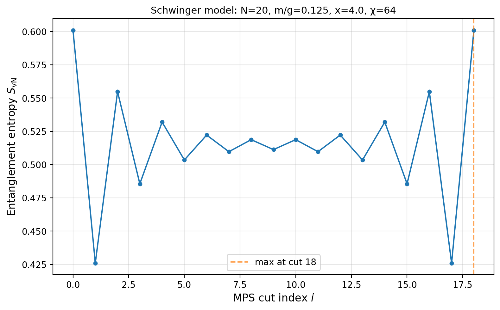
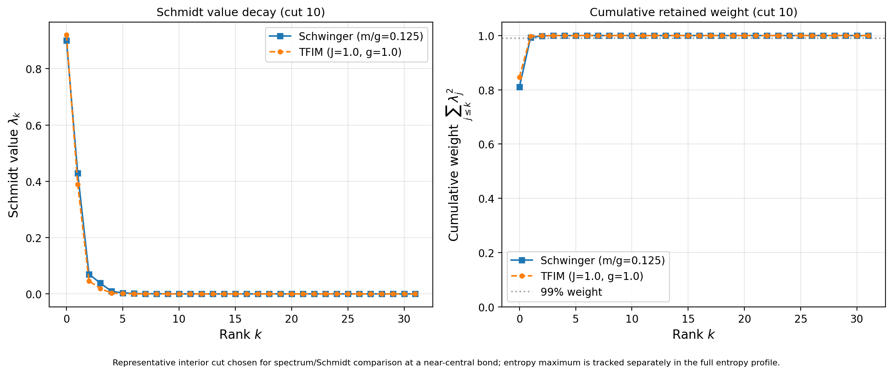
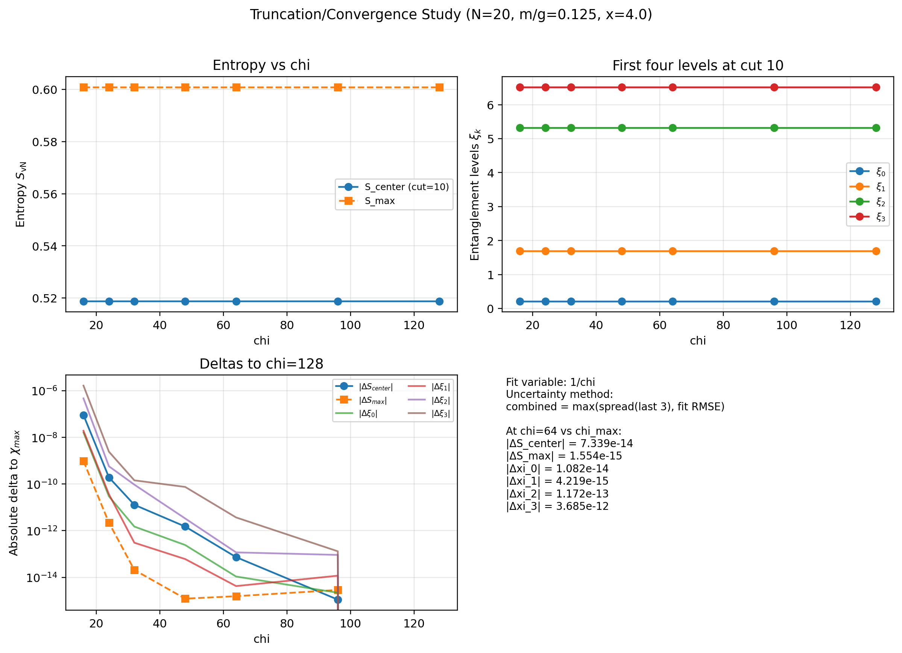
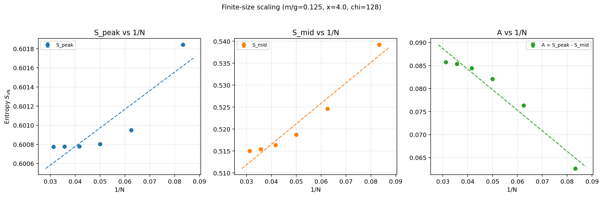
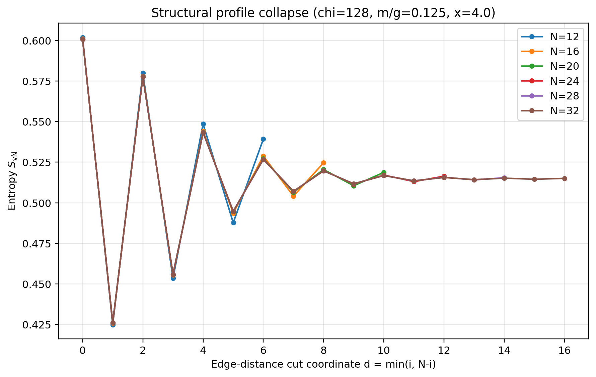
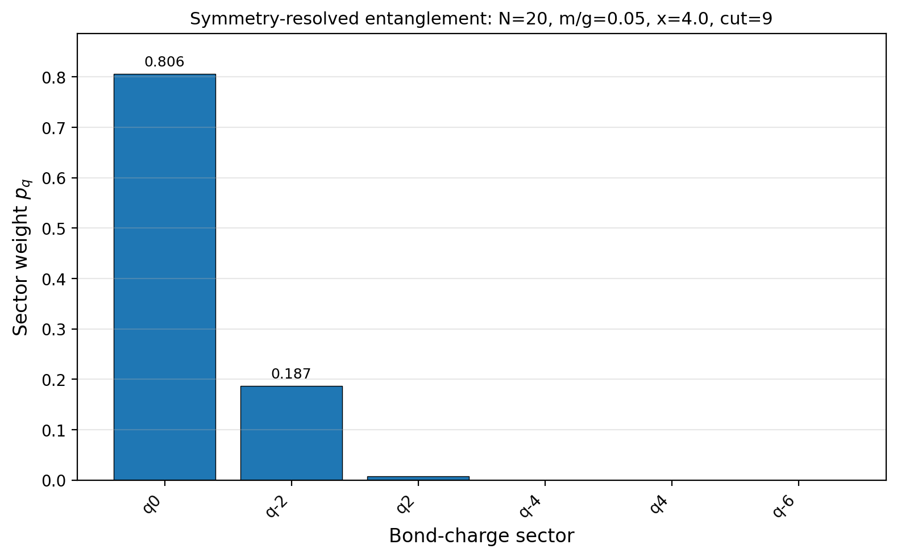
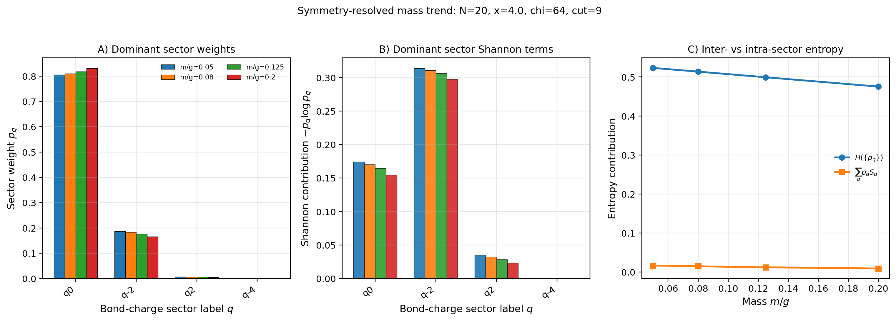
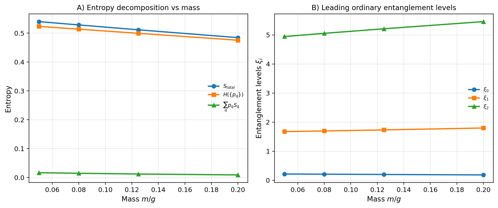
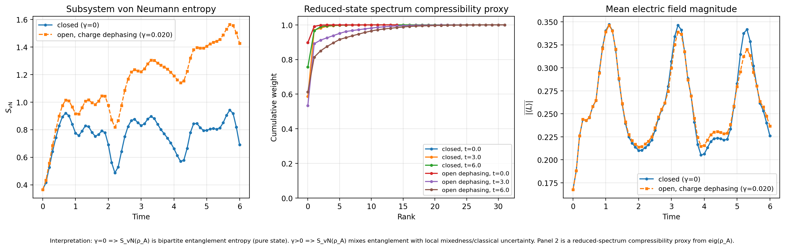

# Entanglement Structure Results & Validation

**Entanglement structure, controlled parameter breadth, and  validation in the lattice Schwinger model**

This document presents the numerical results that complete the **Entanglement Structure QI** stage of the project. It follows the same deliverable-by-deliverable reporting style as the attached *Continuum Physics Results & Validation* template, but is specialized to the Schwinger-model entanglement package built around five thin CLI drivers:

* `schwinger_entanglement_entropy.py`
* `schwinger_entanglement_spectrum.py`
* `schmidt_decay_analysis.py`
* `schwinger_symmetry_resolved_entanglement.py`
* `open_schwinger_entanglement_dynamics.py`

The report is organized around six main deliverables and synthesis layers:

1. **Primary entanglement-structure bundle** at a representative benchmark point, including entropy profile, entanglement spectrum, and Schmidt decay with TFIM comparison.
2. **Controlled breadth extension** via a mass sweep at fixed numerical setup.
3. ** validation** via a bond-dimension truncation study and finite-size scaling analysis.
4. **Symmetry-resolved entanglement extension** via constrained-sector decomposition on a representative interior bond.
5. **Bridge / integration layer** connecting ordinary entanglement diagnostics to the symmetry-resolved picture.
6. **Open-system entanglement dynamics extension** via weak charge dephasing benchmarked directly against the closed Schwinger quench.

Unless stated otherwise, the Schwinger point used as the central benchmark is
$$
N = 20,\qquad m/g = 0.125,\qquad x = 4.0,\qquad \chi = 64,\qquad \mathrm{bc}=\mathrm{open}.
$$
---

## 1. Primary Entanglement-Structure Bundle

**Code:** `schwinger_entanglement_entropy.py`, `schwinger_entanglement_spectrum.py`, `schmidt_decay_analysis.py`

### 1.1 Setup and benchmark point

The core entanglement package was run at a fixed Schwinger point
$$
N=20,\quad m/g=0.125,\quad x=4.0,\quad \chi=64,
$$
with open boundary conditions and a TFIM reference comparison enabled for the spectrum and Schmidt-decay scripts.

The analysis deliberately distinguishes two cuts:

* the **entropy-max cut**, determined from the full entropy profile,
* the **representative interior cut**, used for spectrum and Schmidt diagnostics.

For this benchmark bundle, the full entropy profile gives a tied maximum at cuts ([0,18]) under the mirrored-boundary tie policy, with canonical representative `18`, while the shared **interior comparison cut** is chosen as `10`.

### 1.2 Entropy profile across the lattice

The entropy driver produces the full bipartite von Neumann entropy profile
$$
S_{\mathrm{vN}}(i)
$$
across all MPS cuts. At the benchmark point, the profile is strongly structured and oscillatory rather than featureless.

The main quantitative outputs are:

* maximum entropy:
$$
  S_{\max}=0.6008030783,
$$
* canonical maximum cut: `18`,
* representative interior entropy at `cut = 10`:
$$
  S(i=10)=0.5187166753.
$$
The profile is not centrally peaked. Instead, it shows strong edge-adjacent structure, which later becomes important in the finite-size validation and edge-distance profile collapse.

**Result (entropy profile figure)**

### 1.3 Entanglement spectrum at a representative interior cut

At the common representative cut `10`, the spectrum driver extracts Schmidt values and converts them to ordinary entanglement levels
$$
\xi_i = -\log(\lambda_i^2).
$$
Compared against a TFIM reference at the same (N), the Schwinger spectrum shows a clear structural distinction.

For the Schwinger point (m/g=0.125):

* $\xi_0 \approx 0.2108$
* $\xi_1 \approx 1.6949$
* $\xi_2 \approx 5.3171$
* $\xi_3 \approx 6.5108$

The Schwinger low-lying levels remain systematically **below** the TFIM reference deeper into the displayed window, meaning the Schwinger state retains more non-negligible Schmidt weight deeper into the spectrum. This is the main qualitative comparison result: the constrained Schwinger state does not merely differ in total entropy, but in the detailed organization of entanglement weight across levels.

**Result (spectrum comparison figure)**

### 1.4 Schmidt decay and cumulative retained weight

At the same representative cut, the Schmidt-decay script shows that both the Schwinger and TFIM states are strongly compressible, but not identically so.

For the Schwinger benchmark:

* $\lambda_0 = 0.899943$
* $\lambda_1 = 0.428496$
* cumulative retained weight after rank 2:
$$
  \sum_{j \le 1}\lambda_j^2 = 0.993506
$$
For the TFIM reference:

* $\lambda_0 = 0.920038$
* $\lambda_1 = 0.388624$
* cumulative retained weight after rank 2:
$$
  \sum_{j \le 1}\lambda_j^2 = 0.997498
$$
So the tensor-network message is clear: the state is highly compressible in Schmidt space, and the first two coefficients already capture (> 99%) of the weight. At the same time, the Schwinger state has a slightly broader tail than TFIM, consistent with the lower Schwinger $\xi_i$ values deeper into the spectrum.

**Result (Schmidt decay / cumulative retained weight figure)**

**Verdict:** The primary bundle establishes a coherent entanglement story: a structured entropy profile, a distinct spectrum relative to TFIM at a representative interior cut, and strong Schmidt-space compressibility compatible with an MPS/tensor-network description. ✔

---

## 2. Controlled Breadth Extension: Mass Sweep

**Code:** `schwinger_entanglement_entropy.py` (all masses), `schwinger_entanglement_spectrum.py` and `schmidt_decay_analysis.py` (representative masses)

### 2.1 Setup

To move beyond a single-point case study, the entanglement package was run over a controlled mass sweep at fixed numerical setup:
$$
N=20,\qquad \chi=64,\qquad x=4.0,\qquad m/g \in \{0.05,0.08,0.125,0.20\}.
$$
Entropy profiles were generated for all four masses, while spectrum and Schmidt comparisons were carried out at representative masses with the same TFIM reference protocol.

### 2.2 Entropy trend across mass

The maximum entropy decreases monotonically with increasing mass:

| (m/g) | $S_{\max}$ | Max cut |
| ----- | ---------: | ------: |
| 0.05  |   0.627635 |      18 |
| 0.08  |   0.617056 |      18 |
| 0.125 |   0.600803 |      18 |
| 0.20  |   0.573195 |      18 |

From the lightest to the heaviest mass in the sweep, the peak entropy drops by
$$
\Delta S_{\max} = 0.05444,
$$
which is an (8.67%) reduction relative to the (m/g=0.05) point.

The representative interior cut follows the same direction. In the explicitly compared runs,

* $(S(i=10)=0.5541)$ at $(m/g=0.05)$
* $(S(i=10)=0.5187)$ at $(m/g=0.125)$

Thus the sweep gives a controlled physics trend rather than a single benchmark anecdote: lighter mass corresponds to more broadly distributed bipartite entanglement in the tested regime.

**Result (mass-sweep entropy comparison figure)**

### 2.3 Spectrum / Schmidt organization across regimes

The mass comparison also changes the internal Schmidt organization:

* the heavier point (m/g=0.125) has a slightly larger leading Schmidt value, $\lambda_0 \approx 0.8999$ vs (0.8887),
* while the lighter point (m/g=0.05) has the larger second Schmidt coefficient, $\lambda_1 \approx 0.4496$ vs (0.4285).

This is consistent with a modestly broader entanglement distribution in the lighter-mass regime. Both regimes remain strongly compressible, with cumulative weight close to unity by low rank, so the effect is real but moderate rather than a phase-level reorganization.

**Verdict:** The mass sweep provides controlled breadth at fixed $N,\chi,x$, showing that the package can resolve reproducible entanglement changes across regimes rather than only reproduce one canonical run. ✔

---

## 3.  Validation

This section upgrades the application-style breadth package into a proper numerical validation bundle by quantifying both **bond-dimension convergence** and **finite-size behavior**.

### 3.1 Bond-dimension truncation study

**Code:** `schwinger_entanglement_entropy.py`, `schwinger_entanglement_spectrum.py`, plus aggregation/fit scripts for `chi` convergence

A 7-point bond-dimension ladder was run at the fixed benchmark point:
$$
\chi \in \{16,24,32,48,64,96,128\}.
$$
The tracked observables were:

* $S_{\mathrm{center}}$ at `cut = 10`
* $S_{\max}$
* low-lying entanglement levels $\xi_0,\xi_1,\xi_2,\xi_3$

#### Convergence to $\chi_{\max}=128$

At $\chi=64$ versus $\chi=128$, the absolute differences are

| Observable | $\lvert\Delta\rvert$ to $\chi=128$ |
|---|---:|
| $\lvert\Delta S_{\mathrm{center}}\rvert$ | $7.338574\times 10^{-14}$ |
| $\lvert\Delta S_{\max}\rvert$            | $1.554312\times 10^{-15}$ |
| $\lvert\Delta \xi_0\rvert$               | $1.082467\times 10^{-14}$ |
| $\lvert\Delta \xi_1\rvert$               | $4.218847\times 10^{-15}$ |
| $\lvert\Delta \xi_2\rvert$               | $1.172396\times 10^{-13}$ |
| $\lvert\Delta \xi_3\rvert$               | $3.685052\times 10^{-12}$ |

A simple linear extrapolation in $1/\chi$ over the highest four $\chi$ values, with uncertainty defined as
$$
\max\!\left(\text{spread over last 3 points},\, \mathrm{fit\;RMSE}\right),
$$
gives:

| Observable            | Extrapolated value |        Fit uncertainty | Verdict |
| --------------------- | -----------------: | ---------------------: | ------- |
| $S_{\mathrm{center}}$ |       0.5187166753 | $3.360\times 10^{-13}$ | stable  |
| $S_{\max}$            |       0.6008030783 | $2.887\times 10^{-15}$ | stable  |
| $\xi_0$               |       0.2108475125 | $5.460\times 10^{-14}$ | stable  |
| $\xi_1$               |       1.6949486465 | $1.359\times 10^{-14}$ | stable  |
| $\xi_2$               |       5.3171260197 | $8.573\times 10^{-13}$ | stable  |
| $\xi_3$               |       6.5108049652 | $1.674\times 10^{-11}$ | stable  |

The conclusion is unambiguous: for the displayed static entanglement observables, $\chi=64$ is already effectively converged.

**Result (truncation/convergence figure)**

### 3.2 Finite-size scaling

**Code:** entropy driver plus finite-size aggregation scripts

A finite-size study was then performed at fixed
$$
m/g=0.125,\qquad x=4.0,\qquad \chi=128,
$$
using
$$
N \in \{12,16,20,24,28,32\}.
$$
Three observables were fitted linearly in (1/N):

* $(S_{\mathrm{peak}}(N))$
* $(S_{\mathrm{mid}}(N))$, with mid cut defined by $i=\lfloor N/2 \rfloor$
* $(A(N)=S_{\mathrm{peak}}(N)-S_{\mathrm{mid}}(N))$

The fit results are:

| Observable                             | Fit form        | Extrapolated value | Fit uncertainty | Verdict          |
| -------------------------------------- | --------------- | -----------------: | --------------: | ---------------- |
| $S_{\mathrm{peak}}$                    | linear in (1/N) |       0.6000003432 |    0.0002657039 | controlled trend |
| $S_{\mathrm{mid}}$                     | linear in (1/N) |       0.4978936436 |    0.0031712909 | controlled trend |
| $A=S_{\mathrm{peak}}-S_{\mathrm{mid}}$ | linear in (1/N) |       0.1021066996 |    0.0029140782 | controlled trend |

These fits support three distinct conclusions:

1. **Peak entropy is close to saturation.**
   The extrapolated $S_{\mathrm{peak}}$ is tightly clustered near (0.6000).

2. **Mid-cut entropy still drifts with size.**
   $S_{\mathrm{mid}}$ has appreciably larger finite-size dependence than the peak observable.

3. **Boundary enhancement remains finite.**
   The amplitude
$$
   A = S_{\mathrm{peak}} - S_{\mathrm{mid}}
$$
   extrapolates to a nonzero value within the current fit model and uncertainty.

**Result (finite-size scaling figure)**

### 3.3 Structural profile collapse in edge-distance coordinates

The raw entropy profiles are even more revealing when replotted in terms of the edge-distance coordinate
$$
d = \min(i,N-i).
$$
In these coordinates, the profiles for (N=12) through (N=32) collapse tightly in the interior and preserve the same oscillatory boundary structure near small (d). This shows that the entanglement profile is organized primarily by **distance from the boundary**, not by absolute cut index alone.

That makes the strongest structural result of the validation bundle:

> the dominant entanglement pattern is edge-structured, with a finite boundary-enhancement amplitude and a near-universal profile when viewed in edge-distance coordinates.

**Result (structural profile collapse figure)**

**Verdict:** The entanglement package is quantitatively validated: the tracked observables are stable under bond-dimension increase, and finite-size analysis supports a persistent edge-structured entanglement profile with nonzero boundary enhancement in the tested size window. ✔

---

## Summary

| Deliverable                    | Test                                                                                                                          | Result                                                                                                           | Status              |
| ------------------------------ | ----------------------------------------------------------------------------------------------------------------------------- | ---------------------------------------------------------------------------------------------------------------- | ------------------- |
| Primary entanglement bundle    | Entropy + spectrum + Schmidt diagnostics at $N=20,\;m/g=0.125,\;x=4.0,\;\chi=64$                                            | $S_{\max}=0.6008$, $S(i=10)=0.5187$, top-2 Schmidt weight $=0.9935$, Schwinger tail broader than TFIM           | ✔ Validated         |
| Controlled breadth             | Mass sweep $m/g=0.05,0.08,0.125,0.20$ at fixed $N,\chi,x$                                                                    | $S_{\max}$ decreases monotonically from 0.6276 to 0.5732                                                         | ✔ Clear trend       |
| Truncation validation          | $\chi=16$–128 ladder at fixed $N=20,\;m/g=0.125,\;x=4.0$                                                                      | All tracked observables stable; $\chi=64$ already within $10^{-12}$-scale of $\chi=128$ for displayed quantities | ✔ Converged         |
| Finite-size scaling            | $N=12$–32 at $\chi=128$                                                                                                       | $S_{\mathrm{peak}}(\infty)=0.6000\pm0.0003$, $A(\infty)=0.1021\pm0.0029$                                         | ✔ Controlled trend  |
| Symmetry-resolved entanglement | Sector decomposition at $N=20,\;x=4.0,\;\chi=64,\;\mathrm{cut}=9$ with mass sweep $m/g=0.05$–0.20                           | Top-2 sectors carry $99.29\%$–$99.57\%$ of the weight; entropy reduction with mass is driven mainly by $H(\{p_q\})$ | ✔ Structural result |
| Entropy–spectrum bridge        | Matched canonical bridge combining symmetry sectors, total entropy, ordinary entanglement levels, and retained Schmidt weight | Sector narrowing with mass is mirrored by stronger leading weight and more suppressed subleading ordinary levels | ✔ Integrated        |
| Open-system entanglement dynamics | Closed vs weakly open quench benchmark at $N=10,\;m/g=0.125,\;x=4.0,\;\mathrm{cut}=4$ with charge dephasing $\gamma=0.02$ | Peak subsystem entropy rises from 0.9420 to 1.5628; rank for 95% retained reduced-state weight rises from 2 to 10 by $t=6$; peak $\langle \lvert L \rvert \rangle$ shifts by less than $10^{-3}$ | ✔ Distinct restructuring |

---

## 4. Symmetry-Resolved Entanglement Extension

**Code:** `schwinger_symmetry_resolved_entanglement.py`
* `open_schwinger_entanglement_dynamics.py`

### 4.1 Setup and sector definition

To extend the package from “how much entanglement?” to “which constrained sectors carry it?”, a symmetry-resolved driver was added at a fixed representative interior bond:
$$
N=20,\qquad x=4.0,\qquad \chi=64,\qquad \mathrm{cut}=9.
$$
The script groups Schmidt values by a conserved-block **bond-charge-like sector label** (q) extracted from the Schmidt decomposition on the bipartition bond. Operationally, this yields a sector-resolved decomposition
$$
S = H({p_q}) + \sum_q p_q S_q,
$$
where:

* $(p_q)$ is the total Schmidt weight in sector (q),
* $(H({p_q}) = -\sum_q p_q \log p_q)$ is the inter-sector Shannon term,
* $(S_q)$ is the normalized intrasector entropy.

The decomposition is numerically exact at machine precision for all masses reported below.

### 4.2 Canonical single-point result

At the canonical point
$$
N=20,\qquad m/g=0.05,\qquad x=4.0,\qquad \chi=64,\qquad \mathrm{cut}=9,
$$
the sector weights are sharply concentrated:

| Sector (q) |             Weight (p_q) |
| ---------- | -----------------------: |
| (q0)       |               0.80570478 |
| (q-2)      |               0.18715392 |
| (q2)       |               0.00712810 |
| (q-4)      |  $1.31975\times 10^{-5}$ |
| (q4)       |  $2.05392\times 10^{-9}$ |
| (q-6)      | $1.73025\times 10^{-15}$ |

The first two sectors already carry
$$
p_{q0}+p_{q-2}=0.99285870,
$$
and the first three sectors carry
$$
0.99998680.
$$
For the same cut, the entropy decomposition is:

* total entropy: $S_{\mathrm{total}} = 0.53966947$
* inter-sector term: (H({p_q}) = 0.52308729)
* weighted intrasector term:
$$
  \sum_q p_q S_q = 0.01658218
$$
Thus the entropy is not only sector-concentrated; it is dominated by the **distribution across sectors** rather than large residual intrasector complexity.

**Result (canonical single-point figure)**

### 4.3 Controlled mass trend at fixed cut

The same decomposition was then evaluated at fixed
$$
N=20,\qquad x=4.0,\qquad \chi=64,\qquad \mathrm{cut}=9,
$$
for the mass set
$$
m/g \in \{0.05,0.08,0.125,0.20\}.
$$
The dominant sector organization evolves monotonically with mass:

| (m/g) | (q0) weight | (q-2) weight | Top-2 cumulative weight | (H({p_q})) | $\sum_q p_q S_q$ | $S_{\mathrm{total}}$ |
| ----- | ----------: | -----------: | ----------------------: | ---------: | ---------------: | -------------------: |
| 0.05  |    0.805705 |     0.187154 |                0.992859 |   0.523087 |         0.016582 |             0.539669 |
| 0.08  |    0.810478 |     0.183125 |                0.993603 |   0.513579 |         0.014594 |             0.528173 |
| 0.125 |    0.817918 |     0.176615 |                0.994533 |   0.499157 |         0.012100 |             0.511257 |
| 0.20  |    0.830380 |     0.165345 |                0.995725 |   0.475287 |         0.008941 |             0.484229 |

Three conclusions follow immediately:

1. **The dominant sector strengthens with mass.**
   (q0) rises from 0.8057 to 0.8304.

2. **Secondary-sector support narrows with mass.**
   (q-2) and (q2) both lose weight as (m/g) increases, while the top-2 cumulative weight rises from 0.9929 to 0.9957.

3. **The total entropy decrease is driven primarily by the inter-sector term.**
   (H({p_q})) drops by about 0.0478 over the sweep, while the weighted intrasector term drops by only about 0.0076.

This is the strongest structural conclusion of the symmetry-resolved extension:

> increasing mass reduces bipartite entanglement mainly by narrowing the sector distribution, not by generating a large collapse of residual intrasector entropy.

**Results (mass-trend figures)**

[symmetry_resolved_entanglement_canonical.csv](./symmetry_resolved_results/N20_m0.05_x4.0_chi64_cut9/symmetry_resolved_entanglement_canonical.csv)

### 4.4 Exact reconstruction and numerical consistency

The symmetry-resolved decomposition reproduces the ordinary bipartite entropy exactly to machine precision for every mass in the sweep:

| (m/g) | Reconstructed total entropy |   Reconstruction error |
| ----- | --------------------------: | ---------------------: |
| 0.05  |                  0.53966947 | $-1.11\times 10^{-16}$ |
| 0.08  |                  0.52817280 | $-1.11\times 10^{-16}$ |
| 0.125 |                  0.51125704 |                 (0.00) |
| 0.20  |                  0.48422873 | $-1.11\times 10^{-16}$ |

This matters because it shows the symmetry extension is not a heuristic rebinning of Schmidt values. It is a numerically exact structural decomposition of the same bipartite entropy already used in the primary benchmark package.

**Verdict:** The symmetry-resolved script upgrades the project from “entanglement amount” to “entanglement organization across constrained sectors,” with a clean mass trend and exact entropy reconstruction. ✔

---

## 5. Bridge: Connecting the Four Workstreams

The completed package now has a clear internal structure:

| Aspect                   | Primary Diagnostics                                        | Breadth Extension                            | Validation Layer                                             | Symmetry-Resolved Extension                                                                           |
| ------------------------ | ---------------------------------------------------------- | -------------------------------------------- | ------------------------------------------------------------ | ----------------------------------------------------------------------------------------------------- |
| Main question            | What does the entanglement look like at a benchmark point? | How does it change across parameter regimes? | Are the displayed effects numerically reliable?              | Which constrained sectors actually carry it?                                                          |
| Main scripts             | Entropy, spectrum, Schmidt decay                           | Same scripts under mass variation            | Truncation and finite-size aggregations                      | Symmetry-resolved sector decomposition + bridge summary                                               |
| Physical signal          | Structured entropy + distinct spectrum + compressibility   | Monotonic mass dependence of entropy scale   | Stable $\chi$-convergence and controlled (1/N) trends        | Entropy dominated by a tiny set of sectors; mass narrows the sector distribution                      |
| Tensor-network relevance | Top Schmidt modes dominate retained weight                 | Compression remains strong across regimes    | Convergence shows the structure is not a truncation artifact | Sector narrowing is mirrored by stronger leading Schmidt weight and more suppressed subleading levels |

### 5.1 Matched canonical bridge at the same representative cut

A matched canonical bundle was assembled at
$$
N=20,\qquad m/g=0.05,\qquad x=4.0,\qquad \chi=64,\qquad \mathrm{cut}=9,
$$
combining:

* full entropy profile,
* ordinary entanglement spectrum at `cut = 9`,
* Schmidt decay / cumulative retained weight at `cut = 9`,
* symmetry-resolved sector weights and entropy decomposition at the same cut.

This bundle closes the logical loop:

* the **entropy profile** identifies the global entanglement scale ($S_{\max}=0.627635$, tied maxima at cuts (0) and (18)),
* the **ordinary spectrum** and **Schmidt decay** show that the state is highly compressible but still retains a nontrivial subleading tail,
* the **symmetry decomposition** shows that most of this entanglement is carried by just two dominant sectors.

### 5.2 Bridge between sector narrowing and ordinary spectrum organization

The matched bridge summary at `cut = 9` tracks the quantities
$$
S_{\mathrm{total}},\quad q_0,\quad q_{-2},\quad H(\{p_q\}),\quad \sum_q p_q S_q,\quad \xi_0,\xi_1,\xi_2
$$
along with retained Schmidt weight at ranks 2 and 3.

Across the four-mass sweep:

| $m/g$ | $S_{\mathrm{total}}$ | $q_0$ | $q_{-2}$ | Top-2 sector weight | $\xi_0$ | $\xi_1$ | $\xi_2$ | Retained weight (rank 2) |
| ----- | -------------------: | -------: | -------: | ------------------: | -------: | -------: | -------: | -----------------------: |
| 0.05  |             0.539669 | 0.805705 | 0.187154 |            0.992859 | 0.218880 | 1.676350 | 4.943825 |                 0.990473 |
| 0.08  |             0.528173 | 0.810478 | 0.183125 |            0.993603 | 0.212561 | 1.698060 | 5.053854 |                 0.991549 |
| 0.125 |             0.511257 | 0.817918 | 0.176615 |            0.994533 | 0.202926 | 1.734185 | 5.210828 |                 0.992882 |
| 0.20  |             0.484229 | 0.830380 | 0.165345 |            0.995725 | 0.187210 | 1.800032 | 5.456670 |                 0.994563 |

This shows that the symmetry-resolved and ordinary diagnostics are tracking the same underlying reorganization:

* as (m/g) increases, the state becomes more concentrated in the dominant sectors,
* the leading Schmidt weight strengthens ($\xi_0$ decreases),
* the subleading ordinary levels are pushed upward ($\xi_1,\xi_2$ increase),
* and the low-rank retained Schmidt weight increases.

So the bridge artifact supports the cleanest possible synthesis:

> sector narrowing with mass is directly mirrored in the ordinary entanglement spectrum through a stronger leading weight and increasingly suppressed subleading levels.

**Result (bridge figure)**

### 5.3 Final integrated scientific picture

The common methodological thread is the same as in the attached continuum-results report: **first establish the scientific observable, then extend it across a controlled comparison axis, then validate the claim numerically, and finally expose the structural mechanism behind the trend.**

For the completed entanglement package, the final scientific picture is:

* the Schwinger ground state shows a nontrivial, edge-structured bipartite entanglement profile,
* the internal Schmidt/spectrum organization differs measurably from a simple TFIM reference,
* the entanglement scale changes systematically with mass,
* the main observables are robust under bond-dimension and finite-size checks,
* the mass dependence of the entropy is explained primarily by a narrowing of the symmetry-sector distribution, not by large changes in residual intrasector entropy,
* and the same entanglement/compressibility framing extends to weakly open dynamics, where charge dephasing substantially increases subsystem entropy and broadens the reduced-state spectrum while only modestly perturbing a simple electric-field observable.

---

## 6. Open-System Entanglement Dynamics Extension

**Code:** `open_schwinger_entanglement_dynamics.py`

### 6.1 Setup and scope

To connect the static entanglement package to the open-system infrastructure, a weakly open Schwinger-quench benchmark was run with a deliberately narrow scope:
$$
N=10,\qquad m/g=0.125,\qquad x=4.0,\qquad \mathrm{cut}=4,\qquad t_{\max}=6.0,\qquad n_t=61,
$$
starting from the prepared state `string_gs` and evolving under the `e0_drop` quench protocol. The comparison is a strict two-case benchmark:

* **closed reference:** $\gamma=0$,
* **open case:** charge dephasing with $\gamma=0.02$.

Reduced-state snapshots were recorded at
$$
t \in \{0,3,6\},
$$
and the three-panel output bundles together:

1. subsystem von Neumann entropy at the chosen cut,
2. a reduced-state spectrum compressibility proxy from the eigenvalues of $\rho_A$,
3. the mean electric-field magnitude $\langle \lvert L \rvert \rangle$.

This extension is intentionally not a broad noise survey. Its purpose is to ask one focused question: how weak openness reshapes the entanglement/compressibility story already established for the closed Schwinger model.

### 6.2 Time-dependent subsystem entropy and physical observable

The main dynamical comparison is not subtle. Under weak charge dephasing, the subsystem entropy proxy increases strongly relative to the closed reference throughout the tested window, while the electric-field observable changes only modestly.

| Metric | Closed $\gamma=0$ | Open $\gamma=0.02$ | $\Delta$ (open$-$closed) | Verdict |
| --- | ---: | ---: | ---: | --- |
| Peak $S_{\mathrm{vN}}$ | 0.942042 | 1.562772 | +0.620730 | strong increase |
| Final $S_{\mathrm{vN}}(t=6)$ | 0.690262 | 1.425648 | +0.735386 | strong increase |
| Mean $S_{\mathrm{vN}}$ over run | 0.762113 | 1.141141 | +0.379028 | strong increase |
| Peak $\langle \lvert L \rvert \rangle$ | 0.347057 | 0.346117 | $-9.39\times 10^{-4}$ | negligible shift |
| Final $\langle \lvert L \rvert \rangle$ | 0.226014 | 0.236624 | +0.010610 | modest shift |

So the open benchmark does not read as “entropy suppression under noise.” In this tested quench, weak dephasing substantially raises the subsystem entropy proxy while leaving a simple gauge-field observable comparatively close to the closed trajectory.

**Result (open dynamics benchmark figure)**

### 6.3 Reduced-state spectrum broadening and compressibility loss

The second diagnostic is what makes the script scientifically valuable rather than just a “noisy entropy plot.” At the post-quench snapshot times, the reduced-state spectrum becomes much less concentrated under dephasing.

| Time | Case | Rank for 95% weight | Rank for 99% weight | Largest eigenvalue of $\rho_A$ | Top-2 cumulative weight |
| ---: | --- | ---: | ---: | ---: | ---: |
| 3 | closed $\gamma=0$ | 2 | 4 | 0.587244 | 0.969821 |
| 3 | open $\gamma=0.02$ | 6 | 14 | 0.534439 | 0.891498 |
| 6 | closed $\gamma=0$ | 2 | 4 | 0.756368 | 0.966631 |
| 6 | open $\gamma=0.02$ | 10 | 17 | 0.612056 | 0.813557 |

By $t=6$, the rank needed to retain 95% of the reduced-state weight increases from 2 to 10, and the rank needed for 99% weight increases from 4 to 17. The top reduced-state eigenvalue also drops from 0.756368 to 0.612056. In tensor-network language, the open evolution is markedly less compressible than the closed one, even though the mean electric-field observable remains only mildly perturbed.

This is the cleanest open-system result of the new script:

> weak charge dephasing reorganizes the reduced-state spectrum in a way that substantially lowers effective tensor-network compressibility.

### 6.4 Interpretation caveat and numerical consistency

The interpretation needs one explicit caveat. For $\gamma=0$, the plotted
$$
S_{\mathrm{vN}}(\rho_A)
$$
is a genuine bipartite entanglement entropy because the global state is pure. For $\gamma>0$, the same quantity mixes entanglement with local mixedness/classical uncertainty and is therefore not a pure entanglement measure. That is why the report labels panel 1 as **subsystem von Neumann entropy** and panel 2 as a **reduced-state spectrum compressibility proxy** rather than a strict pure-state Schmidt decomposition.

Numerically, the run is well behaved. Trace preservation and Hermiticity are maintained to machine precision, with
$$
\max |\Delta \mathrm{Tr}\rho| \lesssim 4.5\times 10^{-16},\qquad \max \|\rho-\rho^\dagger\| = 0,
$$
for both $\gamma=0$ and $\gamma=0.02$, across 11 positivity checks. The minimum checked eigenvalue is slightly negative only at the level of tiny numerical noise, so the benchmark is stable enough to support the reported comparison.

**Verdict:** The open-system extension successfully unifies the Schwinger many-body quench story with the Lindblad infrastructure. In the tested benchmark, weak charge dephasing substantially increases subsystem entropy and broadens the reduced-state spectrum, reducing effective compressibility while only modestly perturbing the electric-field observable. ✔

---

## Source materials used for this report

* `Continuum_Physics_Results_and_Validation.md` (format template)
* `APPLICATION_BREADTH_SUMMARY.md`
* `APPLICATION_MASS_SWEEP_SUMMARY.md`
* `APPLICATION_TRUNCATION_STUDY_SUMMARY.md`
* `observable_fit_summary.json`
* `mass_sweep_metadata.json`
* `finite_size_scaling_table.json`
* `finite_size_scaling_metadata.json`
* `chi_convergence_table.json`
* `symmetry_resolved_metadata_canonical.json`
* `symmetry_resolved_entanglement_canonical.csv`
* `symmetry_resolved_mass_trend_summary_canonical.csv`
* `symmetry_resolved_entropy_spectrum_bridge_canonical.csv`
* benchmark CSV outputs for entropy, spectrum, Schmidt decay, and symmetry-resolved comparisons
* `open_schwinger_entanglement_benchmark_summary_canonical.md`
* `open_schwinger_entanglement_benchmark_summary_canonical.csv`
* `open_schwinger_entanglement_dynamics_canonical.csv`
* `open_schwinger_entanglement_schmidt_snapshots_canonical.csv`
* `run_metadata_canonical.json`
