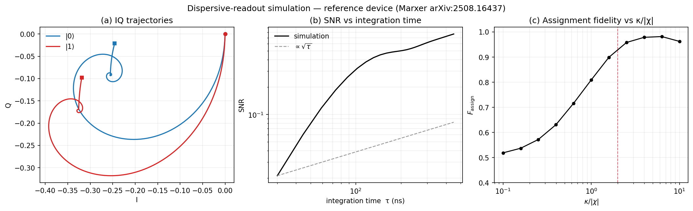
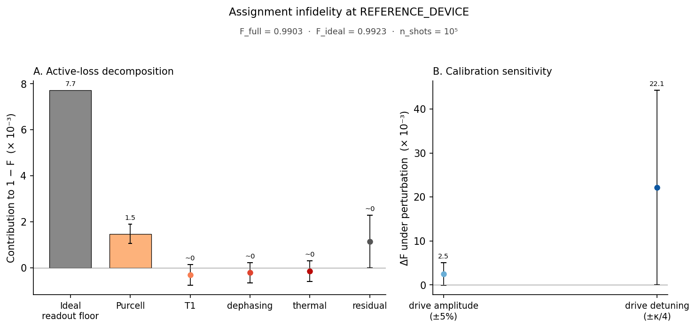
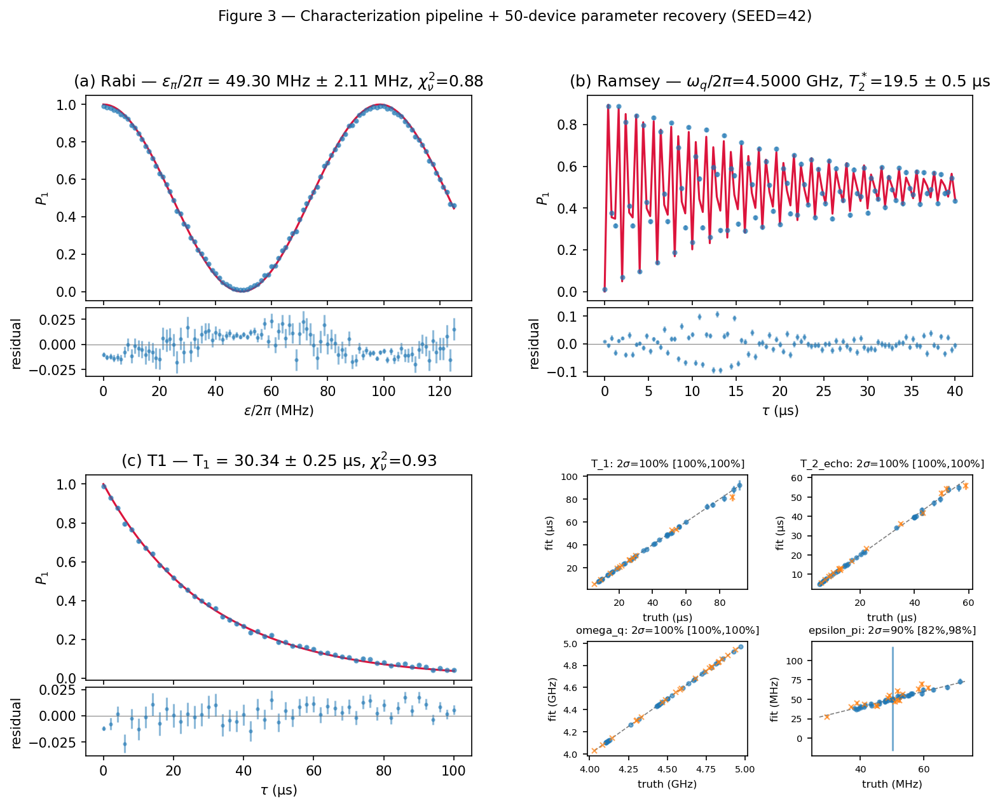
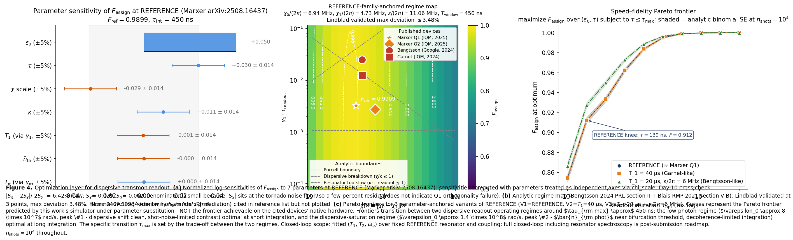
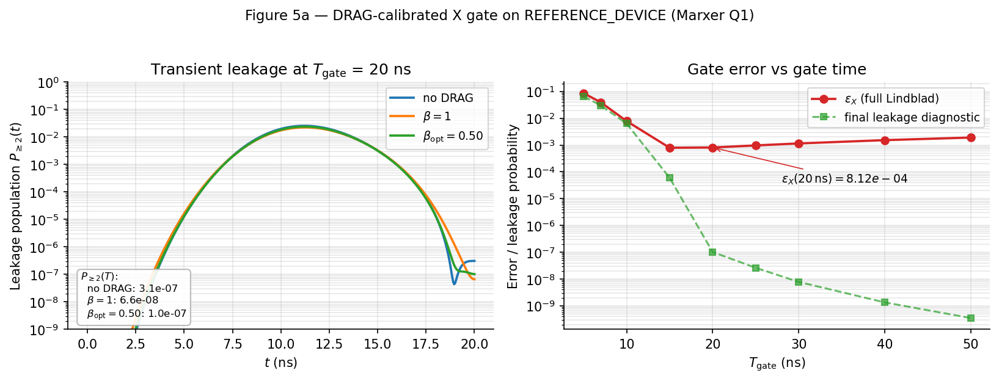
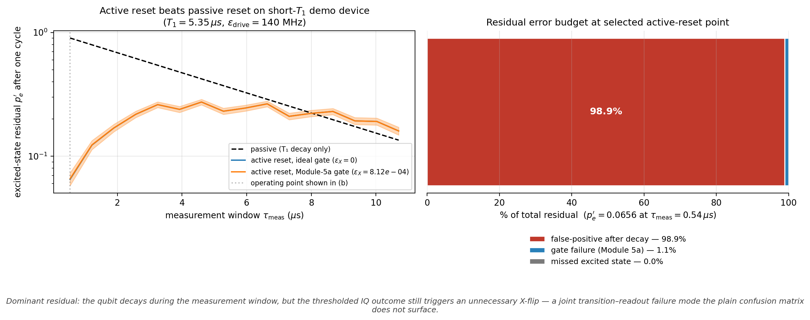

> **Headline deliverable — Stage 06: superconducting-qubit readout, gate, and reset modeling.**
> A 4-module dispersive-readout pipeline plus Module 5a DRAG-gate and Module 5b active-reset extensions, anchored to Marxer et al. (arXiv:2508.16437): validated transmon–resonator Lindblad simulation, four-channel active-loss decomposition, synthetic characterization with parameter recovery, readout sensitivity/regime/Pareto optimization, a DRAG-corrected X-gate simulator with a version-controlled `ε_X(T_gate)` curve, and a semiclassical joint transition–readout reset model. Optimized readout assignment fidelity: **F_assign = 0.9938**. Closed-loop 50-device harness spread: **ΔF = 0.0024**. Reference X-gate probe-set error: **ε_X(20 ns) = 8.12 × 10⁻⁴**. Active-reset residual on the short-T₁ demo device is dominated by joint readout–decay structure rather than conditional-X gate error.
>
> Implementation: `dispersive_readout/`. Drivers: `06_Dispersive_Readout/`. One-page summary: `06_Dispersive_Readout/SUMMARY.md`.
>
> Earlier stages (01–05) develop the open-quantum-system, tensor-network, and noisy-hardware validation infrastructure on a lattice gauge theory testbed.

---

# Lattice-to-Lindblad: Dispersive Readout for Transmon Qubits, Lattice Gauge Theory, and Open Quantum Systems

A Python implementation, validation, and optimization suite for **dispersive readout of superconducting transmon qubits** (Stage 06, the headline deliverable), supported by open-quantum-system, tensor-network, and noisy-hardware infrastructure developed in earlier stages on a **lattice gauge theory** testbed (Schwinger model, 1+1D QED). The repository follows a progressive-validation arc: lattice gauge theory testbeds (Stages 01–05) build the OQS / Lindblad / hardware-mitigation infrastructure that Stage 06 deploys to a superconducting-qubit setting.

## Repository overview

| Stage | Domain | Status |
|---|---|---|
| 01 — Validation Baseline | Gauge + OQS solver baselines | Closed-form analytic agreement at machine precision |
| 02 — Static Benchmarks | ED + VQE + noisy hardware (Aer + Quantum Inspire) | ZNE+MEM reduces Aer noisy energy error from 24.5% to 0.9% |
| 03 — Non-Equilibrium Dynamics | Real-time gauge dynamics, string breaking | Confined vs string-breaking regimes cleanly distinguished |
| 04 — Continuum Physics | DMRG-extended mass gap, 1+8 quarkonium suppression | DMRG-extended mass-gap extrapolation with bootstrap uncertainty |
| 05 — Entanglement Structure | Tensor-network bipartite entropy + symmetry-resolved sectors | Top-2 charge sectors carry > 99.3% of entanglement weight |
| **06 — Dispersive Readout + Single-Qubit Gate + Active Reset** | Superconducting-qubit modeling | 4-module readout pipeline + Module 5a DRAG-gate + Module 5b joint-transition active-reset extensions; 6 figures shipped |

**Project documents:**
- `docs/Theoretical_Framework.pdf` — modeling assumptions, derivations, conventions
- `docs/research_highlight.pdf` — high-level summary of goals, methods, outcomes

## Stage 06 layout (most relevant)

- **Implementation:** `dispersive_readout/` — `physics/`, `analysis/`, `characterization/`, `optimization/`, `control/`, `tests/`
- **Driver scripts and figures:** `06_Dispersive_Readout/scripts/`, `06_Dispersive_Readout/figures/`
- **Design notes:** `06_Dispersive_Readout/README.md` (full), `06_Dispersive_Readout/SUMMARY.md` (one-page)
- **Diagnostic artifacts:** `docs/module4_diagnostics/` — diagnostic markdown + reproducible Python scripts for selected validation findings

---

## 06 — Dispersive Readout for Superconducting Qubits

Stage 06 is the main superconducting-hardware-facing artifact in this repository. It models dispersive readout of a transmon coupled to a readout resonator, validates the simulator against analytic limits, decomposes assignment infidelity into named error channels, fits synthetic characterization traces, and uses the recovered parameters in a readout-optimization layer.

The implementation lives in `dispersive_readout/`; runnable scripts and generated figures live in `06_Dispersive_Readout/`. Validation discipline carries forward from Stage 01 (closed-form analytic agreement) and Stage 04 (singlet–octet OQS framework); noisy-simulator and real-hardware experience from Stage 02 (Aer, Quantum Inspire Tuna-5) informs the synthetic-trace fitting design in Module 3.

### Module 1 — Validated readout model

Open-system simulation of a transmon–resonator system in the second-order Schrieffer–Wolff dispersive frame, with Lindblad channels for transmon relaxation/dephasing, resonator decay, and Purcell decay. The validation suite checks anharmonicity, charge dispersion, dispersive shift, T₁/T₂ recovery, Purcell decay, and Hilbert-space truncation convergence.



IQ trajectories, SNR vs integration time, and assignment fidelity vs κ/|χ| at the reference device.

### Module 2 — Error-budget decomposition

Active-loss decomposition into four independently-toggleable Lindblad channels (T₁ relaxation, pure dephasing, thermal occupation, Purcell-induced decay), marginalized against an analytic ideal-readout floor; calibration sensitivity to ±5% drive-amplitude and ±κ/4 drive-detuning perturbations rendered as a separate panel.



**Panel A — active-loss:** four named channels (T₁ relaxation, pure dephasing, thermal occupation, Purcell decay) at the reference operating point, marginalized against the ideal-readout floor (1 − F_ideal ≈ 7.5×10⁻³); the cross-channel residual R = (F_ideal − F_full) − Σ ΔF_c is consistent with zero within shot-noise propagation. **Panel B — calibration sensitivity:** F loss under ±5% drive-amplitude and ±κ/4 drive-detuning perturbations (separate y-axis; not summable with Panel A).

### Module 3 — Characterization and parameter recovery

Synthetic Rabi / Ramsey / T₁ / T₂* characterization protocols producing fitted device parameters consumed by the optimization layer. The recovery-coverage report quantifies how well fitted parameters match injected ground-truth values across a synthetic device population.



Synthetic traces, fitted parameters, and recovery coverage across the four protocols.

### Module 4 — Sensitivity, regime map, and Pareto optimization

Three-panel composite: (a) local sensitivity of assignment fidelity to readout-relevant parameters, (b) regime-map diagnostics over χ/κ and γ_1·τ_readout with Purcell, χ-phase-accumulation, and resonator-response boundaries, and (c) speed–fidelity Pareto frontiers via multi-start SLSQP over the (ε₀, τ) readout-drive parameter space, with a closed-loop recommendation marker.



The optimal readout drive (ε₀, τ) is invariant across the 50-device characterization harness (T₁ ∈ [5.4, 91.9] μs at SEED=42): σ(ε₀_opt) = 0 to numerical precision, with F_opt varying by 0.0024 across devices due to decoherence alone. This shared-argmax behavior reflects that the dispersive-saturation peak is controlled by (κ, χ, ω_r) — REFERENCE-inherited in the closed-loop pipeline — rather than by decoherence parameters. The result characterizes the parameter regime where the REFERENCE device (Marxer Q1, arXiv:2508.16437) sits. Per-device argmax exploration would require extending Module 3 with resonator spectroscopy and AC-Stark calibration — flagged as a future extension.

The underlying transmon–resonator Lindblad simulator (`dispersive_readout/physics/`) is not specific to readout: the same operator construction, time evolution, and error-channel decomposition apply to single-qubit gate calibration (DRAG, AC-Stark cancellation) or active qubit reset (measurement-based reset, Purcell-filter-assisted reset). Module 5a realizes the DRAG calibration extension; Module 5b realizes joint-transition active reset.

### Module 5a — DRAG-corrected single-qubit X gate

Sin²-windowed-Gaussian π-pulse on the transmon in the Duffing approximation, with calibrated DRAG-1 quadrature correction. The validation suite checks shaped-pulse Rabi dynamics, endpoint smoothness, β-sign convention, truncation convergence, leakage scaling with anharmonicity, and both final and peak leakage behavior. Headline: **ε_X^ref(T_gate = 20 ns) = 8.12 × 10⁻⁴**, where `ε_X` is the probe-set mean X-gate error over `{|0⟩, |1⟩, |+⟩, |+i⟩}` at the selected β calibration.



Figure 5a: DRAG-calibrated X-gate benchmark. Left: transient leakage during a 20 ns pulse. Right: gate-error curve `ε_X(T_gate)` after β calibration, with final leakage shown as a diagnostic. Here `β_opt` is selected by the gate-error objective, not by minimizing leakage alone. The dense diagnostic artifact (`fig5a_drag_leakage.png`, with peak leakage and β-trade-off details) is referenced from `06_Dispersive_Readout/diagnostics/drag_leakage_suppression.md`.

Methodology footnote: calibration was developed across three round-by-round amendments (peak-leakage saturation finding, calibration-objective correction, gate-level fidelity metric upgrade). The narrative is documented in `06_Dispersive_Readout/diagnostics/drag_leakage_suppression.md` and inherits the validation-first discipline established in Module 4.

### Module 5b — Joint-transition active reset

Semiclassical active-reset model using direct T₁/Purcell jump sampling and the same Module 1 pointer-response helper used for dispersive readout. Each trajectory samples whether the qubit decays during the measurement window, propagates the cavity pointer response over the resulting piecewise qubit-state history, thresholds the integrated IQ record, and applies a classical conditional-X feedback model using the Module 5a gate error.



Figure 5b: Left: active reset versus passive T₁ decay on a short-`T₁` demo device (`T₁ = 5.35 μs`), with ideal and Module-5a-realistic conditional-X errors. The active protocol wins at short measurement windows; passive decay catches up at longer waits. Right: residual decomposition at the selected active-reset point. The dominant residual is a joint transition–readout event: the qubit decays during measurement, but the thresholded IQ outcome still triggers an unnecessary X. Gate failure contributes only ~1% of the residual at this operating point — a joint-matrix failure mode the plain confusion matrix does not surface.

The result separates two engineering levers: once the conditional-X error is near `ε_X ≈ 10⁻³`, further reset improvement is dominated by the readout thresholding and feedback policy encoded in the joint transition–readout matrix.

Together, Modules 1–5 cover the three superconducting-control problems most relevant to hardware-facing theory work: readout, single-qubit gate calibration, and reset.

Implementation details and validation findings, including prior-awareness, thermal-population guards, and mesolve consistency checks, are documented in `06_Dispersive_Readout/diagnostics/active_reset_joint_matrix.md`.

### Methodology — validation-first development (Module 4)

Module 4 development surfaced and resolved a series of substantive physics findings during execution. Selected examples — each with a reproducible diagnostic and markdown writeup under `docs/module4_diagnostics/`:

- **Multi-modal F(ε₀) Pareto landscape.** The F(ε₀) surface at REFERENCE has two distinct local maxima separated by a sharp valley (peak #1 at ε ≈ 7.8·10⁷ Hz, peak #2 at ε ≈ 1.5·10⁸ Hz; valley at ε ≈ 1.05·10⁸ Hz). The originally-shipped 5-point linear warm-start grid was structurally unable to sample peak #2's basin. Resolved with a 10-point log-spaced grid + K=5 multi-start SLSQP + per-start sub-grid refinement; F_opt at REFERENCE moves from 0.961 to **0.9938**. See [`warm_start_grid_bug.md`](docs/module4_diagnostics/warm_start_grid_bug.md).
- **Per-level transmon dispersive shifts.** The textbook two-level antisymmetric formula (±χ/2 per state) misses the per-level structure of the transmon ladder. Switching to the full Schrieffer–Wolff per-level χ_j tuple (`χ₀/2π ≈ 6.94 MHz, χ₁/2π ≈ 4.73 MHz` at REFERENCE; ratio 1.47) brings the closed-form regime-map vs. Lindblad simulator gap from 22–27% disagreement down to <5% (max 3.48% across three Lindblad-validation points). See [`per_level_analytic_derivation.md`](docs/module4_diagnostics/per_level_analytic_derivation.md).

<details>
<summary><strong>Two further validation findings from Module 4</strong></summary>

- **τ-window FD-dispatcher consistency.** External adversarial code review caught a high-severity sensitivity-FD-dispatcher bug: τ probes rescaled drive duration without co-perturbing integration window, biasing |S_τ| upward by ~20% (from +0.030 to +0.037, crossing the tornado-rendering threshold). Fixed; closed with a dispatcher-self-consistency regression test that interrogates all 7 sensitivity probes for parameter-configuration alignment. See [`tau_window_correction.md`](docs/module4_diagnostics/tau_window_correction.md).
- **Sensitivity ceiling characterization.** The empirical |S_θ| ceiling under the Lindblad simulator caps at ~0.4 across the realistic parameter space at REFERENCE. Verified as genuine Lindblad physics — not a solver, truncation, or Purcell-isolation artifact — via three independent reproducibility checks (tolerance independence, truncation independence, pure-γ_1 verification at coupling.g = 0). Led to amending `SENSITIVITY_WARNING_THRESHOLD` from the spec-locked 2.0 (unreachable) to 0.3 (aligned with the spec's "dominance" sensitivity level). See [`sensitivity_ceiling_characterization.md`](docs/module4_diagnostics/sensitivity_ceiling_characterization.md).

</details>

The validation-first methodology surfaced these issues before they reached committed figures or downstream analysis.

### How to run

```bash
# Prereq: pip install -r requirements.txt  (qutip, tenpy, etc. — see Getting started below)
pytest dispersive_readout/tests/ -v                                # full suite
pytest dispersive_readout/tests/ -v -m "not slow"                  # fast TDD subset
python 06_Dispersive_Readout/dispersive_readout_simulation.py      # Figure 1
python 06_Dispersive_Readout/scripts/fig2_error_budget.py          # Figure 2
python 06_Dispersive_Readout/characterize.py --help                # Module 3 CLI
python 06_Dispersive_Readout/scripts/fig4_optimization.py          # Figure 4
python 06_Dispersive_Readout/scripts/fig5a_drag_xgate.py           # Figure 5a — README version (Module 5a)
python 06_Dispersive_Readout/scripts/fig5a_drag_leakage.py         # Figure 5a — full diagnostic (peak leakage + β trade-off)
python 06_Dispersive_Readout/scripts/fig5b_active_reset.py         # Figure 5b (Module 5b)
```

### More
- One-page reviewer summary: `06_Dispersive_Readout/SUMMARY.md`
- Full design notes (validations, silent-failure findings, design decisions): `06_Dispersive_Readout/README.md`
- Importable package: `dispersive_readout/`
- Test suite: `dispersive_readout/tests/`

---

## Earlier stages — Lattice gauge theory and entanglement structure

Stages 01–05 develop the open-quantum-system, tensor-network, and noisy-hardware infrastructure on a Schwinger-model (1+1D U(1) gauge theory) testbed. They also document broader scientific scope: continuum-facing extrapolation, real-time dynamics, entanglement-structure diagnostics, and quarkonium-in-medium suppression.

### 01 — Validation Baseline

Pure-gauge U(1) Monte Carlo (Wilson-loop area law cross-checks), gauge-eliminated Schwinger-Hamiltonian sanity checks, and 1⊕1 Lindblad evolution validated against closed-form analytic survival curves at three temperatures. Establishes the building-block correctness reused throughout the repo.


Singlet survival P_s(t) for the minimal 1⊕1 Lindblad model at T = 200, 300, 450 MeV. QuTiP numerical evolution (solid) overlaps the closed-form analytic solution (dashed) to machine precision, validating the solver, unit conversion, and detailed-balance construction.

- **Code:** `01_Validation-Baseline/code/` — `u1_pure_gauge_mc.py`, `schwinger-hamiltonian-check.py`, `OQS_2D_Hilbert_space.py`, `OQS_9D_Hilbert_space.py`
- **Report:** `01_Validation-Baseline/results/Validation_Baseline_Results_and_Validation.pdf`

*Shared infrastructure:* the Lindblad-solver validation discipline established here (closed-form analytic agreement at machine precision) is reused across stages 04 and 06.

### 02 — Static Benchmarks

ED + sector-projected VQE on the Schwinger Hamiltonian (N=4, N=8 with Trotter de-risking), and the `vqe_modular/` package for noisy-simulator (Aer) and real-hardware (Quantum Inspire, Tuna-5) execution with zero-noise extrapolation and measurement-error mitigation. ZNE + MEM reduces Aer noisy error from 24.5% to 0.9% on N=4 Schwinger; on Tuna-5 hardware, gate errors dominate and require richer mitigation than MEM alone.


Energy estimates for the N=4 Schwinger model with bootstrap error bars (top) and absolute error on a log scale (bottom). Aer + ZNE + MEM recovers to within 7×10⁻² of exact — a 27× improvement over raw Aer. On Tuna-5 hardware, MEM alone is insufficient; gate errors dominate.

- **Code:** `02_Static Benchmarks/code/`, `vqe_modular/vqe_runner.py`
- **Report:** `02_Static Benchmarks/results/Static_Benchmarks_Results_and_Validation.pdf`

*Shared infrastructure:* hardware-facing quantum experience on Quantum Inspire (Tuna-5) and Aer noisy simulator; the ZNE + MEM error-mitigation methodology applied here is reused for error-channel decomposition in Stage 06.

### 03 — Non-Equilibrium Gauge Dynamics

Real-time evolution of the Schwinger model under an electric-field quench. Six-panel diagnostic separates confined (heavy mass m/g = 2.5) and string-breaking (light mass m/g = 0.1) regimes via charge density, electric field, excitation count, and Loschmidt echo.


Heavy (m/g = 2.5, confined) vs light (m/g = 0.1, string-breaking) dynamics under an E₀ = 0 quench. Top: charge density heatmaps. Middle: electric-field heatmaps showing lattice-scale oscillations (confined) vs propagating wavefront (string breaking). Bottom: field diagnostics, excitation count, and Loschmidt echo.

- **Code:** `03_Non-Equilibrium Gauge Dynamics/code/field_quench_gauge.py`
- **Report:** `03_Non-Equilibrium Gauge Dynamics/results/Non_Equilibrium_Gauge_Dynamics_Results_and_Validation.pdf`

### 04 — Continuum Physics

Mass-gap continuum extrapolation: ED for N ≤ 20 and TeNPy DMRG for N up to 80, with a joint 2D fit in (1/N, (ag)²) and bootstrap error bands. Headline result M_gap/g = 0.50 ± 0.09 is consistent with the exact Schwinger value 1/√π ≈ 0.5642 at 0.7σ. Also includes 1S/2S quarkonium sequential-suppression dynamics in 1⊕8 Lindblad form.


Left: DMRG-only large-N finite-size convergence at N = 30, 40, 60, 80 across eight lattice spacings. Right: continuum extrapolation in (ag)² = 1/x using the large-N DMRG sequence. Curves visibly approach the exact 1/√π ≈ 0.5642 (dashed); small-N ED/DMRG agreement is documented separately in the validation report.

- **Code:** `04_Continuum Physics Results/`
- **Report:** `04_Continuum Physics Results/Continuum_Physics_Results_and_Validation.md`

*Shared infrastructure:* the singlet–octet (1⊕1, 1⊕8) Lindblad open-system framework (`utils_QOS.py`) is reused in Stage 06's transmon–resonator dispersive simulator.

### 05 — Entanglement Structure / QI Packaging

Tensor-network packaging of Schwinger states: bipartite entropy profiles, entanglement spectra (vs TFIM reference), Schmidt-value decay, symmetry-resolved (charge-sector) entanglement, and weak-dephasing open dynamics. Quantifies how entanglement is *organized* and *compressed*, not just how much there is. Top-2 charge sectors carry > 99.3% of the bipartite entanglement weight at the benchmark point; weak charge dephasing increases peak S_vN by ~1.6× and the rank for 95% reduced-state weight by 5×.


Bipartite von Neumann entropy profiles across all MPS cuts for four masses (m/g = 0.05, 0.08, 0.125, 0.20) at N = 20, χ = 64, x = 4.0. The oscillatory edge-structured profile shifts monotonically downward with increasing mass — controlled parameter sensitivity at fixed truncation.

- **Code:** `05_Entanglement_Structure_QI/code/`
- **Report:** `05_Entanglement_Structure_QI/Entanglement_Structure_Results_and_Val.md`

---

## Getting started

Recommended: **Python 3.10+**

```bash
python -m venv .venv
source .venv/bin/activate
pip install -r requirements.txt
```

TeNPy is included in `requirements.txt` as `physics-tenpy`; QuTiP is required for the Stage 06 Lindblad simulator.

> Some folder names contain spaces (e.g. `02_Static Benchmarks/`); wrap paths in quotes where needed.

---

## Key concepts

- **Progressive validation chain.** Each stage reduces ambiguity in subsequent claims: baseline correctness (Stage 01) → static benchmarks (Stage 02) → real-time dynamics (Stage 03) → continuum extrapolation (Stage 04) → entanglement-structure diagnostics (Stage 05) → superconducting-qubit dispersive readout (Stage 06). Stage 06 inherits validated Lindblad machinery from Stages 01 and 04, and noisy-hardware experience from Stage 02.
- **Validation-first methodology.** Across the repository, claims are validated against analytic limits before optimization or interpretation. Stage 06 logs four named findings caught by this discipline (see Stage 06 §Methodology); Stage 04 mass-gap extrapolation includes ED ↔ DMRG cross-validation; Stage 02 includes ZNE + MEM cross-checks against ED ground truth.
- **Shared OQS infrastructure.** `utils_QOS.py` centralizes Lindblad routines reused across baseline (01), continuum (04), and dispersive readout (06) — the same operator construction, time-evolution, and diagnostic routines applied to qualitatively different physics.

---

## References

**Superconducting-qubit dispersive readout (Stage 06):**
- Marxer et al., arXiv:2508.16437 (2025) — primary reference device.
- Bengtsson et al., *Phys. Rev. Lett.* **132**, 100603 (2024) — secondary reference; integrated dispersive-readout SNR with √(η·κ·τ) factor explicit.
- Sank, arXiv:2402.00413 (2024) — companion paper to Bengtsson; source for κ-distribution measurements used in the Module 4 regime-map overlay (cited in `dispersive_readout/characterization/protocols.py`).
- Abdurakhimov et al., arXiv:2408.12433 (2024) — 20-qubit benchmarks; source for the "Garnet-like" device parameters in the Module 4 regime-map overlay (cited in `dispersive_readout/optimization/regime_map.py`).
- Blais et al., *Rev. Mod. Phys.* **93**, 025005 (2021) — circuit QED reference; cross-check for the dispersive-SNR formula (cited in `dispersive_readout/analysis/purcell_isolation.py`).
- Koch et al., *Phys. Rev. A* **76**, 042319 (2007) — transmon dispersion; used in Module 3's E_J back-solve from fitted ω_q (`dispersive_readout/characterization/fitting.py`) and Module 4's per-level χ structure.

**Open quantum systems / pNRQCD (quarkonium in medium):**
- Brambilla, Escobedo, Soto, Vairo, *Phys. Rev. D* **96**, 034021 (2017); arXiv:1612.07248.
- Brambilla, Magorsch, Strickland, Vairo, Vander Griend, *Phys. Rev. D* **109**, 114016 (2024); arXiv:2403.15545.
- Brambilla, Magorsch, Vairo, arXiv:2508.11743 (2025).

**Quantum information / tensor-structure context:**
- Acuaviva, Makam, Nieuwboer, Pérez-García, Sittner, Walter, Witteveen, *The minimal canonical form of a tensor network*, 2022; arXiv:2209.14358.
- van den Berg, Christandl, Lysikov, Nieuwboer, Walter, Zuiddam, *Computing moment polytopes of tensors, with applications in algebraic complexity and quantum information*, STOC 2025. doi:10.1145/3717823.3718221.

**Gauge / tensor-network / entanglement context:**
- Schwinger-model results in this repository use gauge-eliminated Hamiltonian workflows, ED cross-checks, and TeNPy-based tensor-network extensions.
- The entanglement-structure stage (Stage 05) is intended as a quantitative bridge between lattice gauge dynamics, tensor-network compressibility, and weakly open many-body evolution.
- For broader mathematical context on tensor-network canonical structure, see the Acuaviva et al. and van den Berg et al. references above.

---

<details>
<summary><strong>Repository structure</strong> (full directory tree)</summary>

```text
utils_QOS.py                                  # Shared Lindblad/OQS helpers used by OQS scripts
docs/
  Theoretical_Framework.pdf
  research_highlight.pdf
  results_both.json                           # Aer + QI benchmark results (ZNE + MEM)
  results_qi.json                             # QI-only benchmark results
  module4_diagnostics/                        # Stage 06 Module 4 diagnostic markdown + scripts

06_Dispersive_Readout/                        # Stage 06: stage scripts, figures, summary
  README.md                                   # Full design notes (validations, design decisions, silent-failure findings)
  SUMMARY.md                                  # One-page reviewer summary
  FIGURE_2_CAPTION.md                         # Stage 06 Figure 2 caption
  dispersive_readout_simulation.py            # Figure 1 driver
  characterize.py                             # Module 3 CLI (Rabi / Ramsey / T₁ / T₂*)
  scripts/                                    # Per-figure render scripts
  figures/                                    # Rendered PNGs and supporting YAML

dispersive_readout/                           # Importable Python package
  physics/                                    # Transmon, resonator, dispersive-frame Hamiltonian
  analysis/                                   # Error-budget decomposition + reset metrics
  characterization/                           # Protocol fitters and recovery
  optimization/                               # Sensitivity, regime map, Pareto, recommendation
  control/                                    # DRAG gate pulses (Module 5a) + active-reset protocol (Module 5b)
  tests/                                      # Pytest suite (~40 s full, ~5 s fast)

01_Validation-Baseline/
  code/                                       # u1_pure_gauge_mc.py, schwinger-hamiltonian-check.py, OQS_*.py
  results/Validation_Baseline_Results_and_Validation.pdf

02_Static Benchmarks/
  code/                                       # vqe_optimizer(N=4).py, vqe_optimizer(N=8)_trotter_derisk.py, noisy_vqe_zne.py
  results/Static_Benchmarks_Results_and_Validation.pdf

vqe_modular/                                  # Modular VQE (Aer + Quantum Inspire)
  vqe_runner.py                               # CLI entry point
  models/                                     # Schwinger, TFIM, XXZ, custom .npy
  backends/                                   # Aer noisy simulator, QI provider
  mitigation/                                 # MEM (assignment matrix), ZNE (polynomial)
  core/                                       # Ansatz, Pauli decomposition, shot-based evaluation
  analysis/, plotting/

03_Non-Equilibrium Gauge Dynamics/
  code/field_quench_gauge.py
  results/Non_Equilibrium_Gauge_Dynamics_Results_and_Validation.pdf

04_Continuum Physics Results/
  schwinger_continuum_massgap.py, schwinger_dmrg.py, schwinger_joint_extrapolation.py, OQS_continuum.py
  Continuum_Physics_Results_and_Validation.md
  results/                                    # Joint extrapolation figures and CSVs

05_Entanglement_Structure_QI/
  code/                                       # entanglement_entropy / spectrum / schmidt_decay / symmetry-resolved / open dynamics
  Entanglement_Structure_Results_and_Val.md
  results/                                    # Generated figures and CSVs

figure/                                       # Cross-stage figures (e.g. dmrg_massgap_plot.png)
```

</details>
