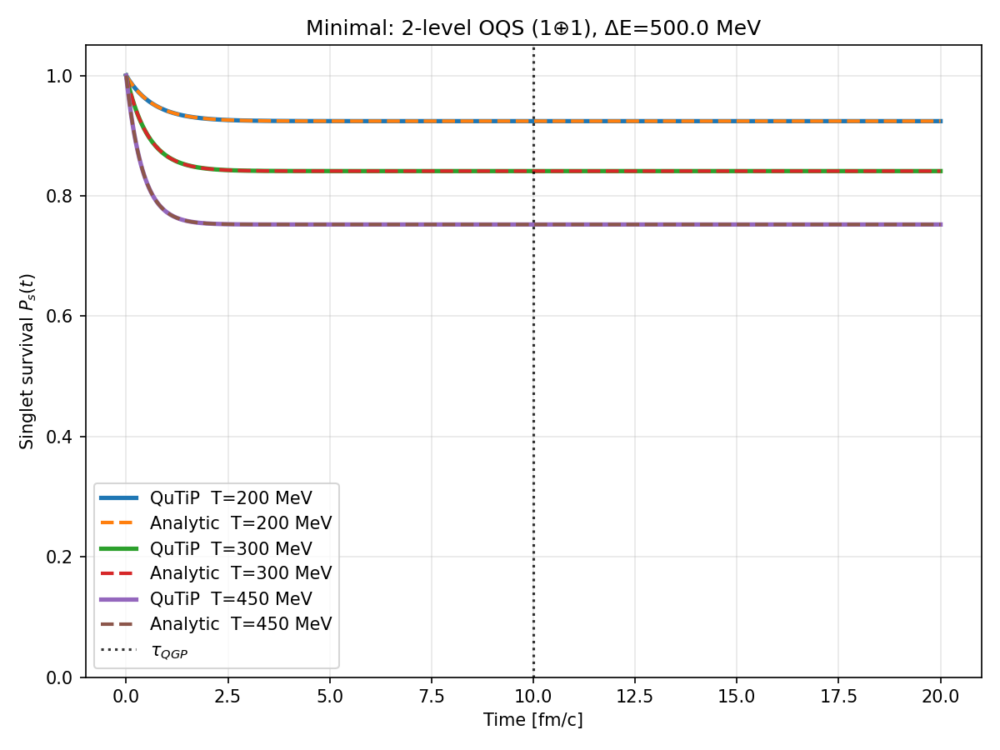
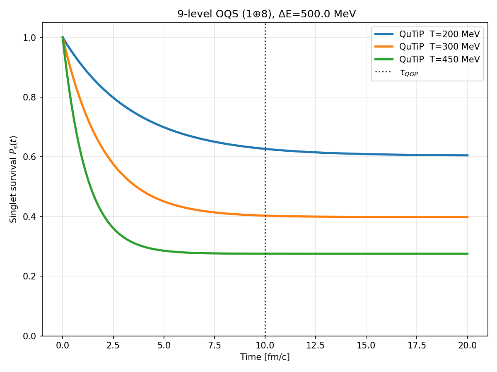
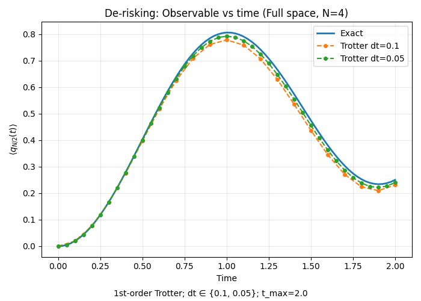
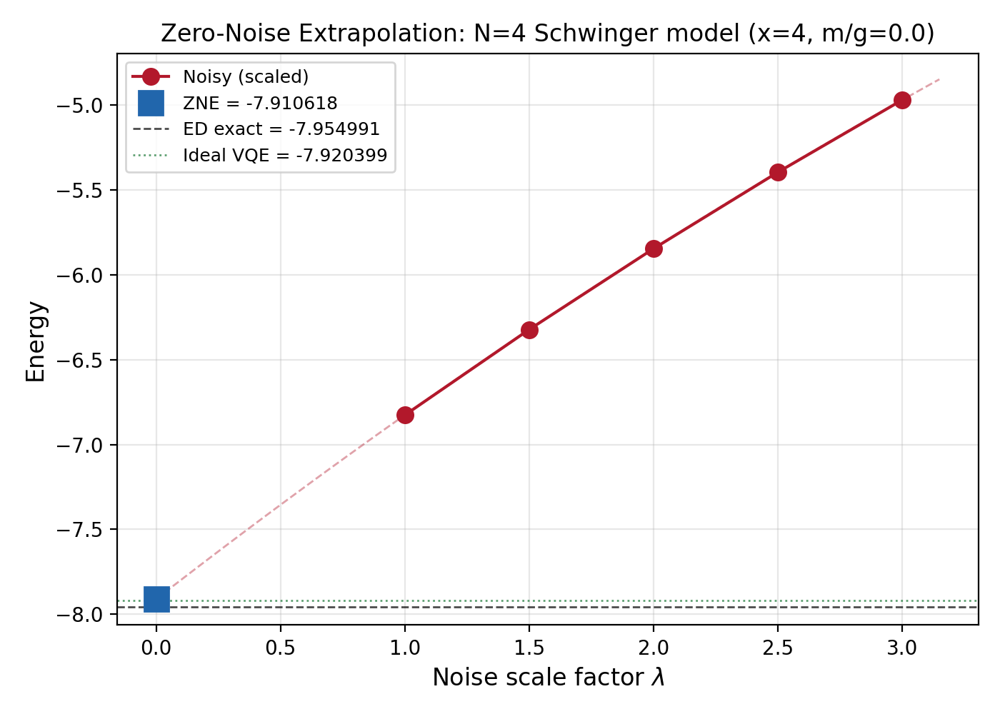
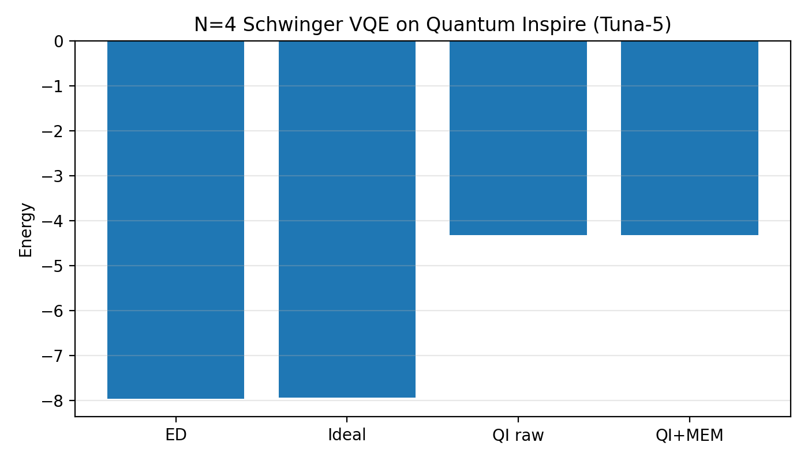
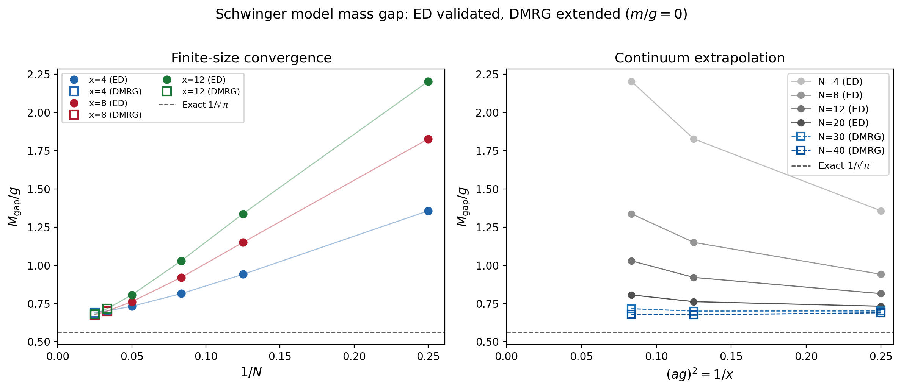
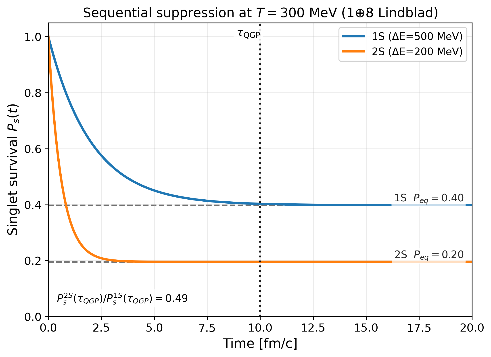
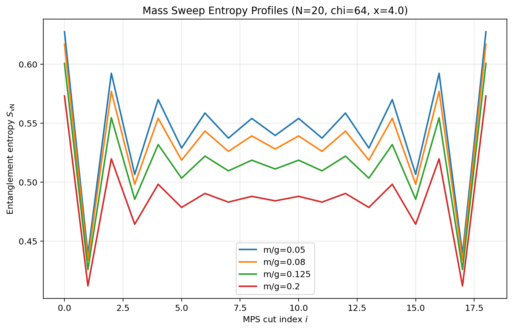
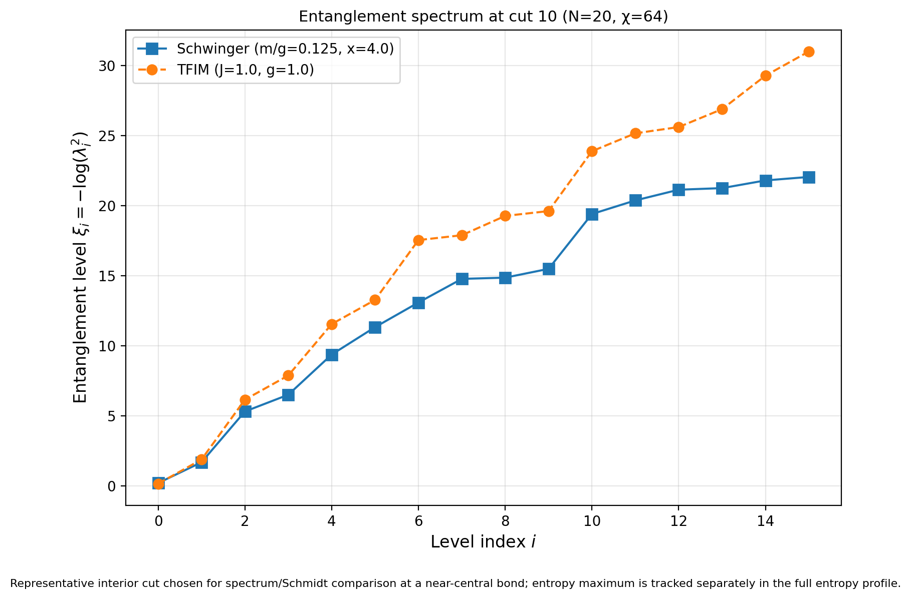

# Lattice-to-Lindblad: Real-Time Gauge Dynamics, Entanglement Structure & Open Quantum Systems

A Python implementation and validation suite spanning **lattice gauge theory (Schwinger model, 1+1D QED)**, **entanglement-structure diagnostics for tensor-network / QI packaging**, and **open quantum systems (pNRQCD-motivated quarkonium in medium)**, with results documented in the included *Results_and_Validation* reports. Shared OQS utilities live in `utils_QOS.py`.


## Overview

This repository contains five stages of code + validation artifacts, organized as a **progressive validation chain**:

| Folder                               | Domain                | Core Method(s)                                                                                                                | Output                                  |
| ------------------------------------ | --------------------- | ----------------------------------------------------------------------------------------------------------------------------- | --------------------------------------- |
| `01_Validation-Baseline/`            | Gauge + OQS           | U(1) MC checks, Schwinger Hamiltonian checks, Lindblad baseline singlet–octet (1 ⊕ 1) evolution                               | Baseline validation PDF + scripts       |
| `02_Static Benchmarks/`              | Gauge + OQS           | ED cross-checks, sector-preserving VQE benchmarks (N=4, N=8)                                                                  | Static benchmark PDF + VQE scripts      |
| `03_Non-Equilibrium Gauge Dynamics/` | Gauge                 | Real-time evolution under electric-field quench; string breaking diagnostics                                                  | Dynamics PDF + quench script            |
| `04_Continuum Physics Results/`      | Gauge + OQS           | Continuum-facing mass-gap analysis with **ED validation (N≤20)** + **DMRG extension (TeNPy, N=30,40)**; continuum OQS studies | Continuum PDF + analysis scripts        |
| `05_Entanglement_Structure_QI/`      | Gauge + QI/OQS bridge | Entropy profiles, entanglement spectra, Schmidt decay, symmetry-resolved entanglement, weakly open entanglement dynamics      | Entanglement-structure report + scripts |

**Project documents:**

* `docs/Theoretical_Framework.pdf` — modeling assumptions, derivations, conventions
* `docs/research_highlight.pdf` — high-level summary of goals, methods, outcomes

---

## 01 — Validation Baseline

Establishes correctness of the building blocks used throughout the repo.

**Gauge (U(1) & Schwinger model)**

* Pure-gauge U(1) Monte Carlo with Wilson-loop diagnostics (area law cross-checks).
* Gauge-eliminated Schwinger Hamiltonian sanity checks (construction/consistency).

**Open quantum systems (Lindblad)**

* Compact Hilbert-space Lindblad evolution in the singlet–octet (1 ⊕ 1) structure.
* Baseline comparisons against controlled/analytic limits (as documented in the validation PDF).

#### 2-level OQS baseline: QuTiP vs analytic solution



Singlet survival P_s(t) for the minimal 1+1 Lindblad model at T = 200, 300, 450 MeV. QuTiP numerical evolution (solid) overlaps the closed-form analytic solution (dashed) to machine precision, validating the solver, unit conversion, and detailed-balance construction.

**Code (examples):**

```bash
python 01_Validation-Baseline/code/u1_pure_gauge_mc.py
python 01_Validation-Baseline/code/schwinger-hamiltonian-check.py
python 01_Validation-Baseline/code/OQS_2D_Hilbert_space.py
python 01_Validation-Baseline/code/OQS_9D_Hilbert_space.py
```

**Results:** `01_Validation-Baseline/results/Validation_Baseline_Results_and_Validation.pdf`

---

## 02 — Static Benchmarks

Benchmarks static observables for the Schwinger Hamiltonian using **ED cross-checks** and **symmetry/sector-preserving VQE** workflows.

* Sector-projected VQE (N=4) for controlled benchmarking.
* Extension toward larger sizes (e.g., N=8) with staged optimization and Trotter de-risking.
* Compact Hilbert-space Lindblad evolution in the singlet–octet (1 ⊕ 8) structure.

#### VQE error vs depth (N=4, sector-projected)

.png>)

Both global and local HVA ansatze show exponential convergence with depth. At 4 layers, both surpass 10⁻⁸ and reach machine precision (~10⁻¹⁰--10⁻¹¹).

#### 9-level singlet-octet dynamics ($1\oplus 8$)



The 9-level model shows substantially stronger suppression than the 2-level baseline due to the 8:1 recombination bottleneck. At T = 300 MeV and tau_QGP = 10 fm/c, singlet survival drops to ~0.41 (vs ~0.84 for 2-level).

#### Trotter de-risking: exact vs first-order Trotter (N=4)



Local charge density ⟨q₂(t)⟩ under exact evolution vs first-order Trotter at dt = 0.1 and 0.05. The O(dt) accumulated error scaling is confirmed quantitatively (ratio ≈ 2.0).

**Code (examples):**

```bash
python "02_Static Benchmarks/code/vqe_optimizer(N=4).py"
python "02_Static Benchmarks/code/vqe_ptimizer(N=8)_trotter_derisk.py"
```

**Results:** `02_Static Benchmarks/results/Static_Benchmarks_Results_and_Validation.pdf`

### Noisy Simulation & Hardware Evaluation (Qiskit + ZNE)

The `vqe_modular/` package extends the static VQE benchmarks to **noisy simulation** (Qiskit Aer) and **real hardware** (Quantum Inspire), with built-in error mitigation:

- **Measurement Error Mitigation (MEM):** full assignment-matrix calibration to correct readout errors.
- **Zero-Noise Extrapolation (ZNE):** scales depolarizing gate-error rates by factors lambda = {1.0, 1.5, 2.0, 2.5, 3.0}, fits a degree-2 polynomial, and extrapolates to lambda = 0.
- **Error-source ablation:** decomposes the total error into gate-only vs readout-only contributions.

Supports multiple Hamiltonians: Schwinger, TFIM, XXZ, and custom `.npy` matrices.

**Results: Schwinger model N=4** (x=4, m/g=0, 4-layer RY-CX-RZ ansatz, Aer noise: p1q=10⁻³, p2q=10⁻², p01=p10=2e-2; QI backend: Tuna-5, 2000 shots)

| Method | Energy | Abs. Error | Error % |
|---|---|---|---|
| ED (exact) | -7.9550 | -- | -- |
| Ideal VQE | -7.9308 | 2.42e-02 | 0.30% |
| Aer noisy (raw) | -6.0085 | 1.946 | 24.5% |
| **Aer ZNE + MEM** | **-7.8834** | **7.16e-02** | **0.90%** |
| QI Tuna-5 (raw) | -4.1415 | 3.813 | 47.9% |
| QI Tuna-5 + MEM | -4.5461 | 3.409 | 42.9% |

**Key finding:** ZNE + MEM reduces the Aer noisy error from 24.5% to 0.9%, recovering 99.1% of the exact energy. On QI Tuna-5 hardware, MEM alone is insufficient — gate errors dominate.

#### Energy comparison: ED vs Ideal vs Aer vs QI


Upper panel: energy estimates with bootstrap error bars and dE annotations. Lower panel: absolute error on a log scale -- Aer+mit (ZNE+MEM) recovers to within 7e-2 of exact, a 27x improvement over raw Aer.

#### Zero-Noise Extrapolation curve



Energy vs noise scale factor lambda. The degree-2 polynomial fit extrapolates to lambda=0 (blue square), landing close to the ED exact (dashed black) and ideal VQE (dotted green) reference lines.

#### Quantum Inspire hardware: QI raw vs QI + MEM



MEM provides only a modest improvement on the Tuna-5 backend, confirming that gate errors — not readout errors — are the dominant noise source on this hardware.

**Code:**
```bash
# Aer noisy + MEM + ZNE + error analysis
python vqe_modular/vqe_runner.py --backend aer --model schwinger --N 4 --x 4 \
  --layers 4 --do_mem --do_zne --error_analysis --save_json results_aer.json --save_plot

# Quantum Inspire hardware + MEM
python vqe_modular/vqe_runner.py --backend qi --qi_backend "Tuna-5" --model schwinger --N 4 --x 4 \
  --layers 4 --do_mem --save_json results_qi.json --save_plot

# Full comparison: Aer + QI
python vqe_modular/vqe_runner.py --backend both --qi_backend "Tuna-5" --model schwinger --N 4 --x 4 \
  --layers 4 --do_mem --do_zne --save_json results_both.json --save_plot
```

**Saved results:** `results_both.json`, `results_qi.json`

---

## 03 — Non-Equilibrium Gauge Dynamics

Real-time dynamics for the Schwinger model under an **electric-field quench**, with diagnostics targeting **string breaking** behavior across regimes (e.g., heavy vs light mass).

#### String breaking: heavy vs light mass quench dynamics


Six-panel diagnostic comparing heavy (m/g=2.5, confined) and light (m/g=0.1, string-breaking) regimes under an E0=0 quench. Top row: charge density heatmaps. Middle row: electric-field heatmaps showing lattice-scale oscillations (confined) vs propagating wavefront (string breaking). Bottom row: field diagnostics, excitation count, and Loschmidt echo.

**Code (example):**

```bash
python "03_Non-Equilibrium Gauge Dynamics/code/field_quench_gauge.py"
```

**Results:** `03_Non-Equilibrium Gauge Dynamics/results/Non_Equilibrium_Gauge_Dynamics_Results_and_Validation.pdf`

---

## 04 — Continuum Physics Results

Continuum-facing and physics-grade analyses that build on validated baselines.

* **Schwinger-model mass-gap** analysis, using ED validation for `N ≤ 20` and DMRG extension to `N = 30, 40`.
* **Continuum OQS/Lindblad** analyses, including suppression studies and optional time-dependent medium evolution.

#### Mass gap: ED validated, DMRG extended ($m/g=0$)



Left: finite-size convergence of M_gap/g vs 1/N at multiple lattice spacings, with ED (filled) and DMRG (open) markers overlapping at matched N. Right: continuum extrapolation in (ag)² = 1/x, with DMRG extending to N=30,40 where ED is infeasible.

#### Joint continuum extrapolation


Two-panel joint fit in 1/N and (ag)² with bootstrap confidence bands. The extrapolated continuum mass gap M(0,0)/g = 0.4469 is consistent with the exact Schwinger result 1/sqrt(pi) ≈ 0.5642 within the systematic uncertainty of the tested lattice sizes and coupling range.

#### Sequential suppression: 1S vs 2S quarkonium



1+8 Lindblad dynamics at T = 300 MeV comparing tightly bound 1S (dE = 500 MeV) and loosely bound 2S (dE = 200 MeV) quarkonium. The 2S dissociates faster and reaches a lower equilibrium (P_eq ≈ 0.20 vs 0.40), with the double ratio P_s(2S)/P_s(1S) = 0.49 at tau_QGP.

**Code (examples):**

```bash
python "04_Continuum Physics Results/code/schwinger_continuum_massgap.py" --help
python "04_Continuum Physics Results/code/schwinger_dmrg.py" --help
python "04_Continuum Physics Results/code/OQS_continuum.py"
```

**Results:** `04_Continuum Physics Results/results/Continuum_Physics_Results_and_Validation.pdf`

---

## 05 — Entanglement Structure / QI Packaging

This stage packages the Schwinger-model results from a **quantum information / tensor-network** perspective. It extends the static and dynamical gauge analyses with diagnostics that quantify not just *how much* entanglement is present, but *how it is organized*, *how compressible it is*, and *how it changes under weak openness*.

### Key results

**Primary entanglement bundle** at a benchmark point (N=20, m/g=0.125, x=4.0, chi=64):
- Von Neumann entropy profile across all MPS bipartition cuts (S_max = 0.6008)
- Entanglement spectrum compared against a TFIM reference (distinct level structure)
- Schmidt decay analysis: top-2 Schmidt values capture >99.35% of the weight

**Controlled breadth** via mass sweep (m/g = 0.05, 0.08, 0.125, 0.20):

| m/g | S_max | Trend |
|---|---|---|
| 0.05 | 0.6276 | Lightest mass, broadest entanglement |
| 0.08 | 0.6171 | |
| 0.125 | 0.6008 | Central benchmark |
| 0.20 | 0.5732 | Heaviest mass, most concentrated |

**Numerical validation:**
- Bond-dimension convergence (chi=16--128): all observables stable, chi=64 within 10⁻¹² of chi=128
- Finite-size scaling (N=12--32): S_peak(inf) = 0.6000 +/- 0.0003, with persistent edge-structured entanglement profile collapsing in edge-distance coordinates

**Symmetry-resolved entanglement:** sector decomposition shows the top 2 charge sectors carry >99.3% of entanglement weight. The entropy reduction with mass is driven primarily by narrowing of the inter-sector distribution (dH ≈ 0.048), not by intrasector changes (d(sum p_q S_q) ≈ 0.008).

**Open-system extension:** weak charge dephasing (gamma=0.02) on a Schwinger quench at N=10:

| Metric | Closed (gamma=0) | Open (gamma=0.02) |
|---|---|---|
| Peak S_vN | 0.942 | 1.563 |
| Rank for 95% rho_A weight (t=6) | 2 | 10 |
| Peak mean abs(L) shift | -- | < 10⁻³ |

Weak openness substantially increases subsystem entropy and reduces tensor-network compressibility while only modestly perturbing the electric-field observable.

#### Mass sweep: entropy profiles across regimes



Bipartite von Neumann entropy profiles across all MPS cuts for four masses at fixed N=20, chi=64, x=4.0. The strongly oscillatory, edge-structured profile shifts monotonically downward with increasing mass, demonstrating controlled parameter sensitivity.

#### Entanglement spectrum: Schwinger vs TFIM



Entanglement levels xi_i = -log(lambda_i²) at a representative interior cut. The Schwinger state retains more non-negligible Schmidt weight deeper into the spectrum than a TFIM reference at the same N, reflecting the distinct entanglement organization of the gauge theory.

### Included scripts

* `schwinger_entanglement_entropy.py` — full bipartite von Neumann entropy profiles across all MPS cuts
* `schwinger_entanglement_spectrum.py` — Schmidt values and entanglement levels at representative cuts, with TFIM comparison
* `schmidt_decay_analysis.py` — Schmidt-value decay, cumulative retained weight, and compressibility
* `schwinger_symmetry_resolved_entanglement.py` — charge-sector decomposition of bipartite entanglement
* `open_schwinger_entanglement_dynamics.py` — weakly open dynamics: subsystem entropy growth and compressibility loss under dephasing

**Results:** `05_Entanglement_Structure_QI/Entanglement_Structure_Results_and_Val.md`, `05_Entanglement_Structure_QI/05_Entanglement_Structure_QI.pdf`

### Scientific scope

This stage is organized around five linked questions:

1. **Entropy profile:** where is entanglement concentrated across the lattice?
2. **Spectrum structure:** how is Schmidt weight distributed across entanglement levels?
3. **Compressibility:** how many Schmidt components retain most of the state weight?
4. **Symmetry resolution:** which constrained sectors actually carry the entanglement?
5. **Open-system extension:** how does weak dissipation reshape subsystem entropy and effective tensor-network compressibility?

### Main results packaged in this stage

* **Structured entropy profiles** across Schwinger-model cuts, with edge-enhanced structure rather than a trivial flat profile.
* **Distinct entanglement spectra** relative to a simple TFIM reference at matched representative cuts.
* **Strong Schmidt-space compressibility**, with low rank capturing nearly all retained weight in closed-state benchmarks.
* **Symmetry-resolved entanglement organization**, showing that most weight is carried by a small number of constrained sectors.
* **Weakly open dynamics benchmark**, showing that charge dephasing can substantially increase subsystem entropy and broaden the reduced-state spectrum while only modestly perturbing a simple electric-field observable.

### Code (examples)

```bash
python "05_Entanglement_Structure_QI/code/schwinger_entanglement_entropy.py" --help
python "05_Entanglement_Structure_QI/code/schwinger_entanglement_spectrum.py" --help
python "05_Entanglement_Structure_QI/code/schmidt_decay_analysis.py" --help
python "05_Entanglement_Structure_QI/code/schwinger_symmetry_resolved_entanglement.py" --help

python "05_Entanglement_Structure_QI/code/open_schwinger_entanglement_dynamics.py" \
  --N 24 --mass 0.125 --coupling 4.0 --chi 64 \
  --cut 11 --tmax 6.0 --nt 61 \
  --gamma 0.0 --gamma-ref 0.02 \
  --channel dephasing \
  --outdir "05_Entanglement_Structure_QI/results/open_dynamics_test"
```

### Outputs

Typical outputs from this stage include:

* entropy-profile CSV/PNG bundles
* entanglement-spectrum and Schmidt-decay comparison figures
* symmetry-resolved sector-weight tables and bridge summaries
* open-dynamics CSV + PNG bundles
* report-style validation summaries in Markdown/PDF form

**Results:**
`05_Entanglement_Structure_QI/results/Entanglement_Structure_Results_and_Validation.pdf`

---

## Repository Structure

```text
utils_QOS.py                                  # Shared Lindblad/OQS helpers used by OQS scripts
docs/
  Theoretical_Framework.pdf
  research_highlight.pdf
  results_both.json                             # Aer + QI benchmark results (ZNE + MEM)
  results_qi.json                               # QI-only benchmark results
  summary_vqe_gap.png                           # Energy comparison figure (ED/Ideal/Aer/QI)
  noisy_vqe_zne.png                             # ZNE extrapolation curve
  qi_vqe_mem.png                                # QI hardware bar chart

01_Validation-Baseline/
  code/
    u1_pure_gauge_mc.py
    schwinger-hamiltonian-check.py
    OQS_2D_Hilbert_space.py
    OQS_9D_Hilbert_space.py
  results/
    Validation_Baseline_Results_and_Validation.pdf

02_Static Benchmarks/
  code/
    vqe_optimizer(N=4).py
    vqe_ptimizer(N=8)_trotter_derisk.py
    noisy_vqe_zne.py                            # Standalone QI evaluation + MEM
  results/
    Static_Benchmarks_Results_and_Validation.pdf

vqe_modular/                                    # Modular VQE benchmark (Aer + Quantum Inspire)
    vqe_runner.py                               # CLI entry point
    models/                                     # Schwinger, TFIM, XXZ, custom .npy
    backends/                                   # Aer noisy simulator, QI provider
    mitigation/                                 # MEM (assignment matrix), ZNE (polynomial extrapolation)
    core/                                       # Ansatz, Pauli decomposition, shot-based evaluation
    analysis/                                   # Error-source ablation
    plotting/                                   # Summary figures

03_Non-Equilibrium Gauge Dynamics/
  code/
    field_quench_gauge.py
  results/
    Non_Equilibrium_Gauge_Dynamics_Results_and_Validation.pdf

04_Continuum Physics Results/
  code/
    schwinger_continuum_massgap.py
    schwinger_dmrg.py
    OQS_continuum.py
  results/
    Continuum_Physics_Results_and_Validation.pdf

05_Entanglement_Structure_QI/
  code/
    schwinger_entanglement_entropy.py
    schwinger_entanglement_spectrum.py
    schmidt_decay_analysis.py
    schwinger_symmetry_resolved_entanglement.py
    open_schwinger_entanglement_dynamics.py
  results/
    Entanglement_Structure_Results_and_Validation.pdf
    figures/                                    # Generated plots (entropy, spectrum, Schmidt, etc.)
    application_breadth/                        # Mass sweep, chi convergence, size check results
    publication_validation/                     # Truncation study, finite-size scaling
    symmetry_resolved_results/                  # Sector decomposition outputs
    open_dynamics_results/                      # Closed vs open quench benchmark
```

---

## Getting Started

Recommended: **Python 3.10+**

```bash
python -m venv .venv
source .venv/bin/activate
pip install -r requirements.txt
```

TeNPy is included in `requirements.txt` as `physics-tenpy`.

> Note: some folders include spaces; wrap paths in quotes where needed.

---

## Key Concepts

### Progressive validation chain

Each stage is designed to reduce ambiguity in later physics claims:

1. baseline correctness
2. static benchmarks
3. real-time gauge dynamics
4. continuum-facing extrapolation / OQS packaging
5. entanglement-structure and compressibility analysis

### Symmetry / constraint preservation

Where applicable, workflows aim to respect physical constraints:

* Gauss-law / gauge structure through gauge elimination
* symmetry / sector projection in VQE
* constrained-sector decomposition in symmetry-resolved entanglement analysis

### Tensor-network perspective

The entanglement-structure stage makes the tensor-network story explicit by tracking:

* entropy profiles across cuts
* entanglement spectra
* Schmidt decay and retained weight
* reduced-spectrum broadening under weak openness

This makes it possible to discuss **effective compressibility**, not just raw observable values.

### Tensor-network extension (DMRG)

For continuum-facing Schwinger mass-gap results, ED is used for `N ≤ 20` validation, and TeNPy DMRG extends to `N = 30, 40` with symmetry conservation (`conserve="Sz"`) and `χ = 100`. The long-range electric term is implemented in a compact running-sum MPO to avoid quadratic MPO growth.

### Open-system modeling (Lindblad)

The quarkonium-in-medium component uses a singlet–octet open-system framework and studies survival/suppression under medium effects, with controlled baseline checks documented in the validation reports.

The Schwinger open-dynamics extension complements this by asking a different question: how weak dissipation changes **many-body entanglement structure**, subsystem entropy growth, and reduced-state spectrum compressibility in a lattice gauge theory quench.

### Shared OQS utilities

`utils_QOS.py` centralizes common Lindblad/OQS routines so baseline, continuum, and validation scripts reuse the same operator, propagation, and diagnostic logic.

---

## References

**Open quantum systems / pNRQCD (quarkonium in medium):**

* [1] Brambilla, Escobedo, Soto, Vairo, *Phys. Rev. D* **96**, 034021 (2017); arXiv:1612.07248.
* [2] Brambilla, Magorsch, Strickland, Vairo, Vander Griend, *Phys. Rev. D* **109**, 114016 (2024); arXiv:2403.15545.
* [3] Brambilla, Magorsch, Vairo, arXiv:2508.11743 (2025).
  
 **Quantum information / tensor-structure context:**
 
* [4] Acuaviva, Makam, Nieuwboer, Pérez-García, Sittner, Walter, Witteveen, *The minimal canonical form of a tensor network*, 2022; arXiv:2209.14358.
* [5] van den Berg, Christandl, Lysikov, Nieuwboer, Walter, Zuiddam, *Computing moment polytopes of tensors, with applications in algebraic complexity and quantum information*, STOC 2025. doi:10.1145/3717823.3718221.

**Gauge / tensor-network / entanglement context:**

* Schwinger-model results in this repository use gauge-eliminated Hamiltonian workflows, ED cross-checks, and TeNPy-based tensor-network extensions where applicable.
* The entanglement-structure stage is intended as a quantitative bridge between lattice gauge dynamics, tensor-network compressibility, and weakly open many-body evolution.
* For broader mathematical context on tensor-network canonical structure and representability questions, see Refs. [4] and [5].
